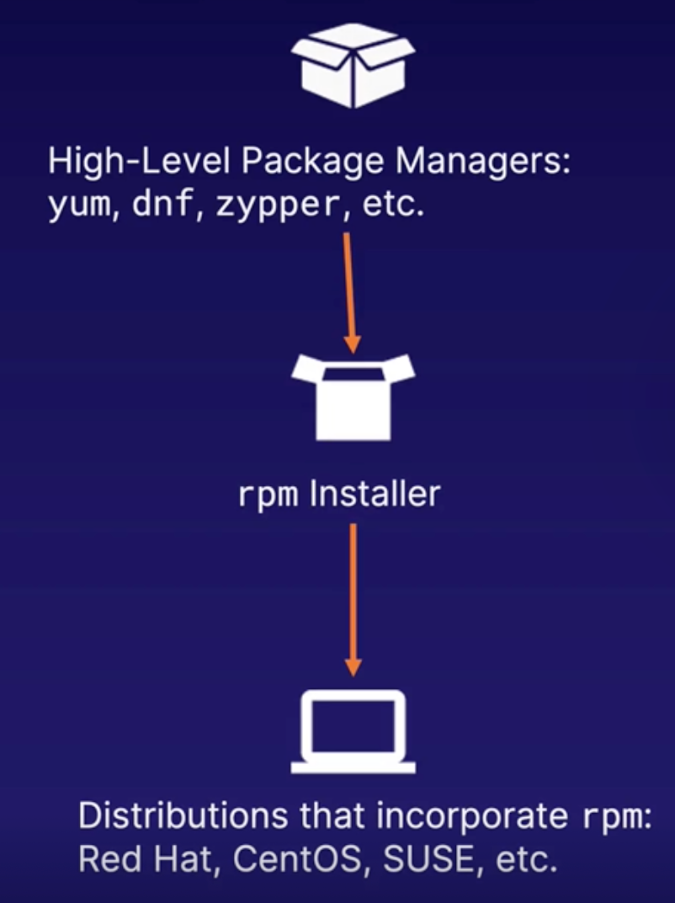
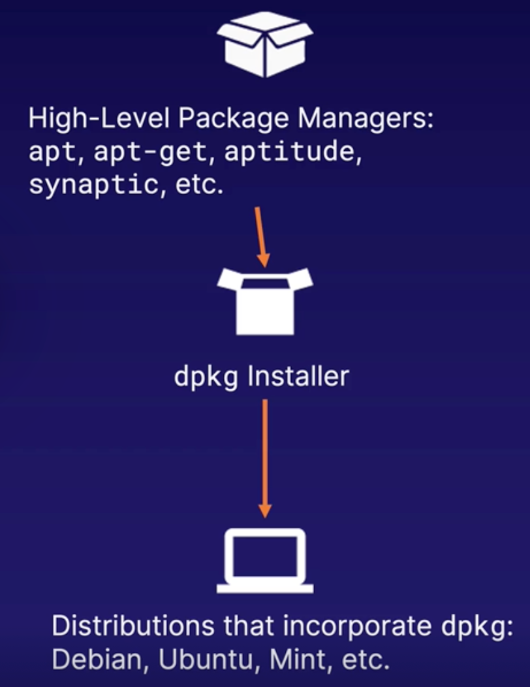

# Linux Fundamentals
1. **[Understanding the Linux Operating System](#topic1)**

    Learn about the history, architecture, and distributions of Linux.

2. **[Understanding Linux Startup](#topic2)**

    Follow the steps of Linux startup, including the BIOS/UEFI, the bootloader, the kernel, and the post kernel (Systemd).

3. **[Understanding Software Installation and Package Management](#topic3)**

    Learn about software installation and package management on Debian and Red Hat-based distributions.

4. **[Using Linux Documentation](#topic4)**

    Understand how to use Linux documentation, including the manual pages, the GNU info system, and the help command.
   
5. **[Understanding Linux Filesystems and Default Directories](#topic5)**
   
    Learn about Linux filesystems and default directories on a Linux host.
   
6. **[File and Directory Management](#topic6)**

    Learn how to manage files and directories using command line utilities.

7. **[User and Group Management](#topic7)**

    Learn how to create, modify, and remove users with command line utilities.

8. **[File and Directory Permissions](#topic8)**

    Manage the ownership and permissions of files and directories for security and collaboration.

9. **Viewing Text and Redirecting Input/Output**

    Understand the commands used for viewing text and the concepts and symbols used for redirecting input/output.

10. **Viewing and Terminating System Processes**

    Learn how to view running processes on the host and how to terminate them when necessary.

11. **Basic Networking and Networking Utilities**
    
    Understand the basics of networking and how to use command line utilities to gain information and make modifications.

<br>

<a id="topic1"></a>

## 1. Understanding the Linux Operating System
### A Brief History of the Linux Operating System
- The Unix operating system was created in 1969 at Bell Labs and was released in 1971.
- In 1983, Richard Stallman started the GNU Project with the goal of creating a completely free, Unix-compatible software system.
- In 1991, Linus Torvalds created his own operating system kernel, which became known as the Linux kernel.
- In 1992, the Linux kernel became available under the GNU General Public License,combined with the utilities developed by the GNU Project.


<br>

### The Architecture of the Linux Operating System
**Utilities | Shell | Kernel | Hardware**
- ***Utilities***

    User Applications:
      Programs and applications used by individuals and system users (i.e., text editors, web servers, etc.).

- ***Shell***

    User Interface:
      The Command Line or Graphical Interface used to interact with the system.
    
- ***Kernel***

    Operating System Core:
      A program that is responsible for handling interactions between software and hardware.
    
- ***Hardware***

    System Hardware:
      This includes the Central Processing Unit (CPU), physical memory, storage devices, and peripherals.    

<br>

### The Distributions of the Linux Operating System
##### Popular Linux Distributions:
- Red Hat Enterprise Linux
- SUSE Linux Enterprise
- Ubuntu
- Debian
- Fedora
- OpenSUSE
- Linux Mint
- Arch Linux


#### Key Differences:
- Desktop Environments
- Package Managers
- Driver Support
- Goal/Purpose

<br>
<a id="topic2"></a>

## 2. Understanding Linux Startup
### Understanding the BIOS/UEFI

The Basic Input/Output System (BIOS) or Unified Extensible Firmware Interface (UEFI):
- Firmware that is stored in a chip on the motherboard
- Detects and maps connected devices
- Performs a **power-on-self-test** (POST) of the system hardware
- Initiates the boot sequence from a connected device
- Modern systems use the UEFI
<br><br>

### Understanding the Bootloader
- Generally stored in the first block or a specific partition of the bootable device
- Loads the kernel image
- Loads the `initrd` (or `initramfs`) image
- The GRand Unified Bootloader (GRUB) is the primary bootloader for most Linux distributions. GRUB2 is used in new systems.
<br><br>

### Understanding the Kernel
- The central component of the Linux operating system
- A compressed image located in the `/boot` directory of the filesystem
- Configures the system 
- Mounts the root filesystem
- Runs the main initialization process (i.e., `Systemd`)
<br><br>

### Understanding Post Kernel/Systemd
- `Systemd` is the primary initialization process for most Linux distributions
- `Systemd` is responsible for spawning all other processes
- `Systemd` spawns processes in parallel
- `Systemd` brings a system to a predefined state known as a **target**
<br><br>

### Linux Startup Overview
1. ***The BIOS/UEFI***

    Validates that the hardware is functioning properly and locates a *bootable device*

2. ***The Bootloader***

    Loads the kernel and `initrd` (or `initramfs`) images

3. ***The Kernel***

    Configures the system, mounts the root filesystem, and runs the main initialization process

4. ***Post Kernel/Systemd***

    Spawns the system and user-level processes

<br>
<a id="topic3"></a>

## 3. Understanding Software Installation and Package Management
### Understanding RHEL-Based Package Management
 

Example: 
```shell
#Search
sudo yum search apache

#Install
sudo yum install httpd

#View installed httpd
sudo yum list installed | grep httpd

#Update ALL packages
sudo yum update
#Or update a specific package
sudo yum update httpd -y

#Unisntall package on its own
sudo yum remove httpd -y
#Unisntall package with its dependencies
sudo yum autoremove httpd -y
```
<br>

### Understanding Debian-Based Package Management


Example:
```shell
#Update package manager
sudo apt update

#Search
sudo apt search apache # | head

#Since previous search did not return desired outcome, you can search in another utility associated with package manager
sudo apt-cache search apache # | head

#Install
sudo apt install apache2

#Uninstall package on its own
sudo apt remove apache2
#Unisntall package with its dependencies
sudo apt autoremove apache2
```

<br>
<a id="topic4"></a>

## 4. Using Linux Documentation
### Manual Pages
These are the main source of Linux documentation (man pages for short). 
They provide information on programs, utilities, configuration files, etc.
Man pages are divided into chapters/sections, ordered 1-9.

**Command line use:** 
`man [OPTIONS] topic.`
```shell
man ls
man -f ls #to see all pages available for this command
whatis ls #whatis command is alias to -f option

#Use -k flag to search for command with keyword
#This will return all pages that have something to do with keyword 'list'
#The output is in alphabetical order with name of the page and breif description
man -k list
#Or use the following 
apropos list

#Go to specified man page
man -f printf   #Print pages available(output below)
# printf (3)     - formatted output conversion
# printf (1)     - format and print data
man printf      #Will go to the first page available
man 3 printf    #Will go to 3rd page
```

### GNU Info System
The standard documentation format for the GNU Project. 
It resembles man pages but uses links to connect topics. 
Topics in an info page are referred to as nodes. 
Nodes can contain menus and linked subtopics/items.

**Command line use:** 
`info [OPTIONS] topic.`

```shell
info
info <command> #info ls
```

### The `help` Command and `--help` Option
The help command shows a synopsis of built-in, popular commands. 
These commands come bundled with the shell that users use to interact with the system. 
Most commands have a short description that can be accessed with the `--help` or `-h` option.

```shell
help
help <command> #help pwd
ls --help # ls -h
```


<br>
<a id="topic5"></a>

## 5. Understanding Linux Filesystems and Default Directories
### Understanding Linux Filesystems
> **_Note_**
>
>The **Virtual File System** (also known as the Virtual Filesystem Switch) is the software layer in the kernel that provides the filesystem interface to
userspace programs. 
It also provides an abstraction within the kernel which allows different filesystem implementations to coexist." <br>
(kernel.org)


- Common Linux filesystems: ext* family (ext2, ext3, and ext4), XFS, btrfs, ZFS, etc.
- Provides a structured way to store data (i.e., files)
- Determines the amount and size of files that can be
stored

```shell
tree -L
#.
#├── bin -> usr/bin
#├── boot
#├── dev
#├── etc
#├── home
#├── lib -> usr/lib
#├── lib64 -> usr/lib64
#├── media
#├── mnt
#├── opt
#├── proc
#├── root
#├── run
#├── sbin
#├── usr/sbin
#├── srv
#├── sys
#├── tmp
#├── usr
#└── var
```


### Understanding Default Directories

|Direcotry|Details|
|---|---|
|**/**|The Linux filesystem is structured in a hierarchy beginning at the root directory ("/")|
|**/home**|User home directories. Contains user-specific configuration files and data|
|**/etc**|System-wide configuration files. These files are used to control the operation of a program|
|**/usr/local**|Contains locally installed software. The directory structure is purposely similar to that of the root ("/") directory|
|**/opt**|Reserved for the installation of add-on application software packages|
|**/root**|Home directory of the root user. Contains configuration files and data for the root user|
|**/srv**|Data for services provided by the system|


<br>
<a id="topic6"></a>

## 6. File and Directory Management
### Commands for Listing and Viewing Files and Directories
|Command| Details |
|---|---|
|**ls**|List directory contents. Common options include ```-a``` to show all files (including hidden files) and ```-l``` to use long listing format.|
|**pwd**|Print the name of the current/working directory.|
|**cd**|Change the working directory. Some special characters include: the current working directory **(" .")**, the parent directory **("..")**, the previous working directory **("-")**, and the user's home directory **("~")**.|
|**cat**|Concatenate files and print on the standard output.|
|**vi**|Visual display editor. A common Linux text editor utility. Can also be used to create files.|


### Commands for Creating and Removing Files and Directories
|Command| Details |
|---|---|
|**touch**|Change the timestamp for existing files or create new files. You can create multiple files at once ```touch text1 text2 text3```|
|**mkdir**|Create a directory (ies), if they do not already exist. The ```-p``` option will create parent directories as needed.|
|**cp**|Copy files and directories. the ```-r/-R```option is used to copy directories recursively.|
|**mv**|Move or rename files.|
|**rm**|Remove files or directories. The ```-r/-R``` option removes directories and their contents recursively. The ```-f``` option removes the prompt when deleting files/directories. To delete everything within directory you can use wildcard command ```rm -f Documents/*```|
|**rmdir**|Remove empty directories|


<br>
<a id="topic7"></a>

## 7. User and Group Management
### Creating Users and Groups
|Command| Details |
|---|---|
|**useradd**|Create a new user or update default new user information.|
|**groupadd**|Create a new group.|

### Modifying Users and Groups
|Command| Details |
|---|---|
|**passwd**|Change a user password. The super user, root, may change the password for any user.|
|**usermod**|Modify user account.|
|**groupmod**|Modify a group definition on the system.|

### Deleting Users and Groups
|Command| Details |
|---|---|
|**userdel**|Delete a user account and related files.|
|**groupdel**|Delete a group.|


Example
```shell
sudo -i

#Create dev and ops groups
groupadd dev
cat /etc/group #Group created: dev:x:1005:
groupadd -g 1200 ops #Create group with specific group ID (-g). Result: ops:x:1200

#Add users
useradd clark
id clark #Result: uid=1004(clark) gid=1201(clark) groups=1201(clark)
ll /home/ #Should have group "clark" created in home directory

#Create user and assign him/her to a created group(ops)
useradd -M -g ops barry #-M to do not create home directory, -g to assign to an existing group
id barry #Result: uid=1005(barry) gid=1200(ops) groups=1200(ops)

cat /ect/passwd #To see user created

#Mody user and groups
id clark #Result: uid=1004(clark) gid=1201(clark) groups=1201(clark)
usermod -G dev,ops -u 1300 clark #-G to assign to additional groups(separated by comas), -u to change UID
group mod -n dev2 dev
id clark #Result: uid=1300(clark) gid=1201(clark) groups=1201(clark), 1200(ops), 1005(dev2)

#Create home directory and assign it to "barry" user
mkdir/home/flash
chown barry:ops /home/flash
usermod -d /home/flash barry

#Delete group and users
groupdel dev2 #Suplementary groups can be deleted, however, for primary group deletion, users need to be deleted/reassigned first
cat /etc/group
userdel barry
id barry #Result: "id: barry: no such user"

#Update/create password
passwd clark
#New password:
#Retype new password:
#Result on success: "passwd: all authentication tokens updated successfully."

#Login as clark
exit #To logout as root user
su - clark
#Password:
id #Result: "uid=1300(clark) gid=1201(clark) groups=1201(clark), 1200(ops)"
pwd #Result: "/home/flash". Note: Upon successful login, you will be redirected to home dir of the user
```


<br>
<a id="topic8"></a>

## 8. File and Directory Permissions
### Managing File and Directory Permissions

|Command| Details |
|---|---|
|**chown**|Change file owner and group. The -R option can be used to change files and directories recursively.|
|**chgrp**|Change group ownership.|
|**chmod**|Change file mode bits (a.k.a.permissions).<br><br>The format can be in symbolic mode or octal mode (0-7). <br>1. Symbolic mode permissions: read (r),write (w), and execute (x). <br>2. Octal mode permissions: read (4), write (2), and execute (1).|


