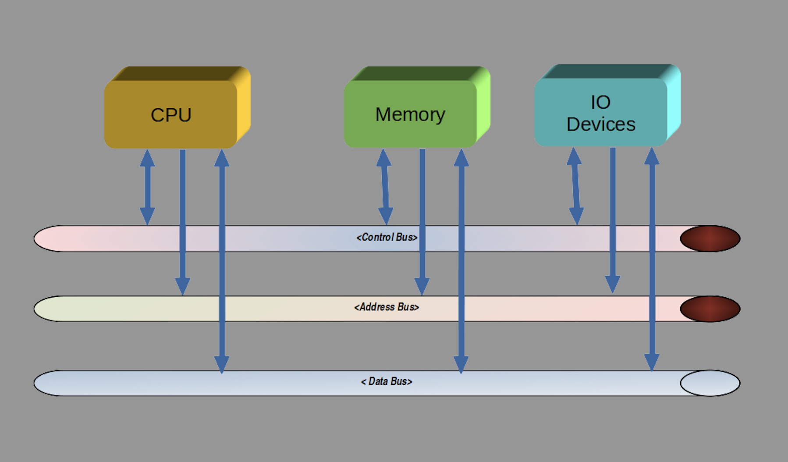
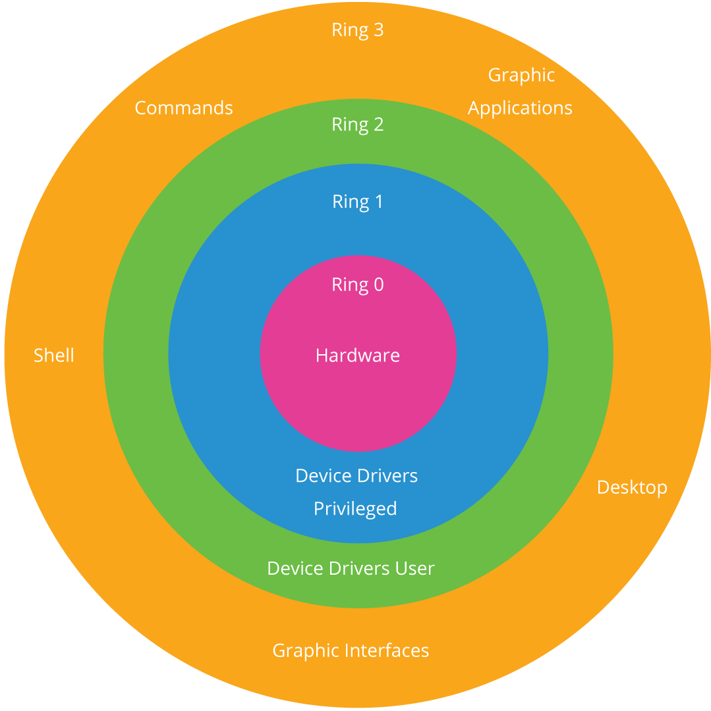
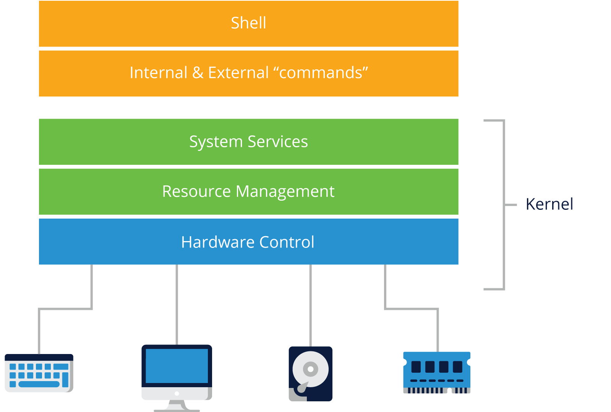

# 2. WHAT IS LINUX?

## Introduction
- **Chapter Overview**

    In this section, we will examine what an operating system is and does, and focus specifically on Linux-based systems. This is a high level view of several components that make up an operating system like Linux.


- **Learning Objectives**

    We will examine some of the components of an operating system by exploring some of the issues that have led to the creation of various operating systems.

    By the end of this chapter, you should be able to:

    - Understand what an operating system is and why we need one.
    
    - Discuss what Linux is.
    
    - Discuss the reasons to use Linux.
    
    - Explain what the relationship between hardware and software is.
    
    - Explain what bus architectures are and understand what the role of kernel device drivers is.


## The Operating System
- **What Is an Operating System?**

    A list of commonly used operating systems includes Microsoft Windows, MacOS, UNIX, Linux, and many others. They share many common features, and, at the same time, exhibit many differing aspects.

    What is an operating system? The Merriam-Webster dictionary defines an operating system as:

    ``` 
    "software that controls the operation of a computer and directs the processing of programs" 
    ```

    Although that is a concise definition, it really does not say much; let's expand on the definition.

    The heart of an operating system is its **kernel**. This is sometimes a very big program, but still a program. In fact, the word Linux technically only refers to the kernel, and not the whole operating system.

    The kernel has privileged features such as the ability to directly control devices connected to it. Devices such as a mouse, keyboard, screen, memory, storage, and many, many more are controlled by the kernel.

    If the outside world would like to access these devices controlled by the Linux kernel, there must be an interface to interact with it; this interface is in fact another program, a program that can communicate with the kernel to cause some action in the hardware to occur (e.g., actions like light a bulb, read a key button being depressed, etc). Assembling the components so far, we have a kernel that controls the hardware and a program that wants to access the hardware, but the program is unaware of how to communicate with the devices. We need an interface between the kernel and the user program.

    The **system call** is the fundamental interface between an application and the Linux kernel.

    This interface between the user program and the Linux kernel is the system call (or **syscall**), which is privileged code that can make requests to the Linux kernel. The kernel accepts the properly formatted request, performs the requested action and issues a return code indicating access or failure.

    An example is a user program that would like to change to another directory (folder): the program calls the function **chdir()** which invokes the **syscall chdir()** which is in the Linux kernel. A success or failure code (return code) is provided to the user program by the Kernel and to the function for examination.

- **Tasks Performed by an Operating System**
  
    |Task|Description|
    |---|---|
    |Processes|A process is any actively running instance of a program. On computers with multi-core processors, Linux can manage how to divide the program so that it runs on more than one processor at a time.|
    |Memory Management|Linux manages the sharing of internal memory among processes. Allocating and deallocating addresses in RAM is an important aspect of memory management and will happen thousands of times per second.|
    |File Management|Linux ensures there is sufficient available memory space to load files from disk to memory and back, enforcing the permissions stored with the data.|
    |Input/Output|The Linux kernel handles requests to the hardware like mouse, keyboard, monitor, etc., and ensures the appropriate device driver is loaded for the device.|
    |Interpreting user commands|When a user presses a keyboard key, touches a touchscreen or uses a mouse, the operating system will make sure that the machine responds as the user expects.|
    |Resource allocation|The term is used to describe the combination of process and memory management to ensure that applications have enough processor time and can be allocated sufficient space in RAM as necessary.|

## Linux as an Operating System
- What Is Linux?

    Linux is a free, open source operating system which has now grown to run on a large number of physical computer architectures. For example, almost all major websites, including Google, Facebook, and Wikipedia, and most of the cloud runs on Linux; all 500 of the world’s fastest supercomputers run Linux; and the Android phone operating system is based on the Linux Kernel. Mainframes have long run Linux, and even your refrigerator and many other devices we use daily may run Linux.

    While Linux was originally based on the UNIX operating system, it was written from scratch by Linus Torvalds with assistance from a loosely-knit team of developers across the Net. It aims towards POSIX and Single UNIX Specification compliance where possible.

    Linux has all the features you would expect in a modern, fully-fledged UNIX operating system, including true multitasking, virtual memory, shared libraries, demand loading, shared copy-on-write executables, proper memory management, and multi-stack networking, including IPv4 and IPv6.

    Linux is distributed under the **GNU General Public License, version 2 (GPLv2)**.

- **Reasons to Use Linux**

    - **Free**
        
        Linux is based on open source, freely available software:
        * No recurring licensing fees
        * No initial cost for many distributions
        * No corporate fees

    - **Stable**

        Linux is a very stable operating system; it is unusual for it to crash:
        * Not prone to crash
        * Performance does not deteriorate over time
    
    - **Secure**

        Linux runs in many security levels, from relaxed security on your private network to government required standards:
        * Linux viruses are not as prevalent as those on other operating systems
        * Optional (still free) security enhancements from the NSA can be enabled
        * Free antivirus software if required
    
    - **Maintainability**
    
        The Linux package management tools make it easy to update, add and remove software packages:
        * Updating Linux distributions is straightforward and easy
        * Uses public repositories maintained by various Linux providers
        * If desired, the repository can be company-internal
    
    - **Runs on a wide range of hardware**

        Almost any Intel x86 or later, AMD, ARM, RISC-V and even mainframes can run Linux:
        * Large systems
        * Old systems
        * Refrigerators
        * Televisions
        * Phones
        * And many more.
    
    - **Easy to use**

        The Linux command line is available on almost every installation, but users may never see it or need it:
        * Command line interface
        * Several graphical desktop environments
        * Easy to switch Desktop environments
          
    - **Support**

        * It is community-supported
        * Purchased support from some commercial linux vendors is also available (Red Hat, SUSE, Canonical, etc.)

    - **Open source**
        
        Linux is the largest open source project in the world, with the largest number of contributors.
        * Everyone has access to view and modify Linux
        * Linux uses the GPL2 license.
    


## Hardware and Software
- **Devices and Device Drivers**

    Device drivers control many different types of hardware. Standardization has helped define how hardware is assembled into “main boards” or “motherboards”, where additional components can be connected.

    There are several “bus architectures” used to connect devices in a manner that the CPU can read, write and control the devices. Almost every bus has a selection method, an address mechanism and a data stream. Bus architectures have evolved over time, starting with simple designs with parallel data connections to complex multi-level designs to accommodate large complex implementations. The bus architecture is one of the elements in a computer where performance is observed. One of the benefits of standardization on interconnect methods (buses) is that there is an ever growing selection of devices to connect to a computer. USB is the most popular bus architecture.

    USB connections are typically connected to intermediary hardware before being exposed to the Kernel drivers. These interface components are often arranged in a “bus” architecture. A selection signal may be sent to enable a bus member, allowing communication with the Kernel.

    

    A typical motherboard will have a collection of connections and buses depending on the motherboard form factor. There are decades of development and change in the bus architecture as improvements for speed and capacity continue to drive innovation. Additional reference information is included in the following short list of some of the common buses.

    - **PCI**

        Peripheral Component Interconnect (PCI) is a local computer bus for attaching hardware devices to a computer and is part of the PCI Local Bus standard.

    - **PCI Express** 

        Peripheral Component Interconnect Express (PCI Express), abbreviated as PCIe or PCI-e, is a high-speed serial computer expansion bus standard, designed to replace the older PCI, PCI-X and AGP bus standards.  


- **The Path from User Application to Hardware Access**

    The Kernel is the connection between the computer hardware and end user applications. The levels of abstraction increase, the requirement for absolute control is relinquished to the Kernel and its device drivers to perform the desired actions. For example, to read a file, we could use the cat command provided by the shell without having to know exactly how to select addresses and buses, or how to reserve memory to place the information into it. The Kernel provides resource management and services interfaces.

    Stepping back, we can see the relationship more clearly:

    

    Applications are programs that perform specific activities. In other words, applications assist the user in completing a task such as word processing, web browsing, sending emails, instant messaging, gaming, and system administration utilities.

    The application program uses the operating system (OS). The OS controls the hardware, so when we use the computer, the application needs to talk to the OS. In order to manage the input and output devices, the OS needs to perform its control functions. As end-users, we interact with input devices such as typing. Typing a letter or moving the mouse and performing other functions is interpreted by the OS, the information is passed on to the application, and the application then performs the specific tasks that we want to conduct.

    
    

    In the preceding image, the computer software has been divided into some common components, both for the operating system and the user interface. Notice that the hardware is directly connected to the kernel, which provides services to the user. This interface is known as device drivers, rather than hardware control, since there are many devices to control. Some of the device drivers act on software "devices", which programs that react like real hardware, but are made entirely out of software.

- Types of Computers
