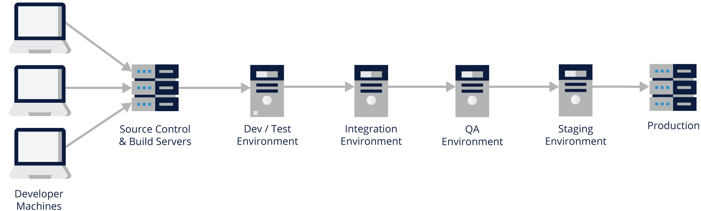
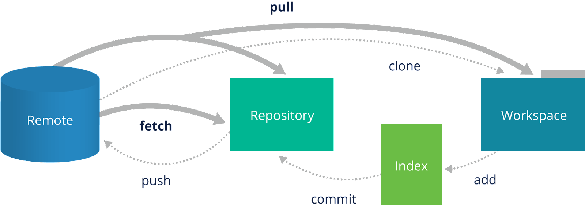

# 10. DEVOPS FUNDAMENTALS
## Introduction
### Chapter Overview

In the past, software developers used to do their engineering in somewhat of a vacuum, and then throw their product over the wall to people in IT to figure out how to deploy the product in production environments. This disconnect often meant that products were difficult to reliably install and operate. DevOps was one answer, designed to bring software developers into the world of IT Operations and IT Operations into the world of software developers. This better connection has resulted in software products that were easier to deploy and better met needs.

Today, by using DevOps methods and Agile project management (discussed in the next chapter), products are continually developed, tested, and deployed in both test and final production environments. These “mini releases” allow software developers, IT Operations and end-customers the opportunity to evaluate the software or new features and provide feedback that can be quickly turned into a better product for all involved.

In this chapter, we will explain what DevOps is and how it improves the overall quality of the resulting software product.

### Learning Objectives
 
By the end of this chapter, you should be able to:

- Understand what DevOps is.
- Discuss basic practices of DevOps.
- Explain how cloud and containers help with implementing DevOps practices.
- Understand general DevOps environments.
- Use Git fundamental commands.

## DevOps Basics
### What Is DevOps?

As the computing environment evolved over time, the traditional model of developing monolithic applications has given way to a more flexible and scalable model. DevOps is a set of practices that combines software development (Dev) and IT operations (Ops). It aims to shorten the systems development life cycle and provide continuous delivery with high software quality. DevOps methods complement Agile software development (which we will discuss in the following chapter); several DevOps aspects came from the Agile methodology.

DevOps combines cultural philosophies, practices, and tools that increase an organization's ability to deliver applications and services at high speeds. Products will evolve and improve at a faster pace than organizations using traditional software development.

There are seven practices in this new approach:

- Configuration management
- Continuous integration
- Automated testing
- Infrastructure as Code
- Continuous delivery
- Continuous deployment
- Continuous monitoring

### Configuration Management

[Configuration management (CM)](https://www.upguard.com/blog/5-configuration-management-boss) is the practice of controlling and managing changes to software using version control in a standard and repeatable way. The practice has two components to it:

- Using versioning control software
- Using a standard code repository management strategy (which defines the process for branching, merging, etc.).

Within the Linux development environment, we have several choices of versioning control software, but, by far, the primary choice is git, which we will discuss later in this chapter.

### Continuous Integration

[Continuous integration (CI)](https://www.thoughtworks.com/continuous-integration) is the practice that requires developers to integrate code into a shared repository often and obtain rapid feedback on its success during active development of a product. This is done as developers finish a specific piece of code and it has successfully passed unit testing. CI also means creating a build using a tool like **Bamboo**/**Jenkins**/**GitLab** that runs after developer code check-in, runs any test you have that can run on this build (unit and integration tests, for example), and provides feedback to the development team if it worked or failed. The goal is to create small workable chunks of code that are validated and integrated back into the centralized code repository as frequently as possible. CI is the foundation for both continuous delivery and continuous deployment DevOps practices, that we discuss later in this chapter.

 

### Automated Testing

[Automated testing](https://smartbear.com/learn/automated-testing/what-is-automated-testing/) is the practice of using software to control the execution of software tests and the comparison of the results. Automation is relied upon to reduce the burden of running repetitive tests manually, to speed up the execution of the testing process, and to allow the execution of difficult tests. These automated tests are usually run during the CI build, as well as when needed. The tests to be automated are unique to the maturity and needs of each program and should be determined on a case-by-case basis.

 

### Infrastructure as Code

[Infrastructure as Code (IaC)](https://stackify.com/what-is-infrastructure-as-code-how-it-works-best-practices-tutorials/) is used to define code that when executed, can create an entire physical or virtual environment, including computing and networking infrastructure. It is a type of IT infrastructure that operation teams can automatically manage and provision through code, rather than using a manual process. An example of using IaC would be to use a tool like [Chef](https://www.chef.io/), [Puppet](https://puppet.com/), or [Ansible](https://www.ansible.com/) to rapidly create nodes in a cloud environment, and then have the ability to destroy and rebuild the environment consistently each time. Doing so gives the user the ability to version control their infrastructure. This is where cloud technologies have significantly helped with providing DevOps environments for building, testing and deploying new iterations of developing product such as an application.

 

### Continuous Delivery

[Continuous delivery](https://aws.amazon.com/devops/continuous-delivery/) is the practice of making every change to source code ready for a production release as soon as automated testing validates it. This includes automatically building, testing and deploying. An approach to code approval and delivery approval needs to be in place to ensure that the code can be deployed in an automated way with appropriate pauses for approval depending on the specific needs of a program.

 

### Continuous Deployment

[Continuous deployment (CD)](https://www.atlassian.com/continuous-delivery/continuous-deployment) is the practice that strives to automate product deployment from start to finish. In order for this practice to be implemented, a team needs to have extremely high confidence in their automated tests (see the "Automated Testing" page). The ultimate goal is that as long as the build has passed all automated tests, the code will be deployed. Manual steps in the deployment process can be maintained if necessary. For example, a team can determine what type of changes can be deployed to production in a completely automated fashion, while other types of changes may require a manual approval step.

 

### Continuous Monitoring
 
[Continuous monitoring](https://www.sumologic.com/glossary/continuous-monitoring/) is the practice of proactively monitoring, alerting, and taking action in key areas to give teams visibility into the health of the application in a production environment. As source code and binaries flow through the system, there are several points where things can go wrong and need to be monitored and potentially corrected. A bad check-in or merge of source code may need to be manually corrected. A failed build of the product needs to be corrected so that a proper build of the software product is produced. Test failures at the unit and system level need to pass or be corrected with source code modifications. Infrastructures used for testing and eventual deployment may change as features are added and code changes. Deployment into a test production or final production environment needs to be monitored and modified if it does not reflect the environments needed to support the product or new features are added to the product during its lifecycle. All of these steps require a watchful eye to ensure the right product is being delivered with high quality.

## Containers
### The Use of Containers in DevOps
 
Containerization entails placing a software component and its environment, dependencies, and configuration into an isolated unit called a container. This makes it possible to deploy an application consistently on any computing environment, whether on-premises or cloud-based.

Containers package the application along with its dependencies, which ensures that an application developed in one environment works in another. This helps developers and testers work collaboratively on the application, which is exactly what DevOps culture is all about. This also provides fast and easy deployment of the application.

Containers can be used in building the application in continuous integration, testing the application either at a unit level or full systems testing through automated testing in a container, and continuously deployed to a container.

Containers that do these functions can be orchestrated using Infrastructure as Code. As an example, Ansible can be used to further call [Kubernetes](https://kubernetes.io/), which can automatically set up containers with storage that has access to your source code. This container can launch [Jenkins](https://www.jenkins.io/), which automates builds. Jenkins can launch the appropriate build tool, such as [make](https://www.gnu.org/software/make/) or [maven](https://maven.apache.org/), that compiles various source files into the application. If the build fails, this is reported along with a list of recently changed source files and the user IDs of those who made the changes. This feedback allows the people who likely broke the build to quickly fix the problems and start over until the build succeeds and passes the properly built application on to testing. Restarting the build may be initiated manually, or automatically at predefined times of the day. For example, it is not unusual for there to be an automatic nightly build. But, if this build breaks for any reason, developers will want to manually do the build after fixing the problem.

If the build produces an application without errors, another container may be created that runs specific [unit level](https://www.xenonstack.com/insights/what-is-unit-testing) and [regression tests](https://www.guru99.com/regression-testing.html). If those tests fail, this is reported. Again, developers can quickly look into the test failures, fix the failing source code, and start the process at the beginning.

If the unit and regression tests pass, the application may be passed to another set of containers that are responsible for full [systems testing](https://www.guru99.com/system-testing.html). Multiple containers may be needed for full systems testing since one container may be running the application, while another container runs a database and another container runs a web front-end to drive the application through various scenarios expected of the application when deployed in production. Again, problems detected are reported, investigated and addressed by the developers.

If all of the testing succeeds, the application may be passed to another set of containers that more accurately reflect the real production environment, for example, by providing a copy of the production database, a real web front-end in a container and any other necessary support for the application. This **staging environment** allows [stakeholders](https://asq.org/quality-resources/stakeholders) and customers to interact with the application in a way that reflects full production. They can determine if it works and looks the way they envisioned. Problems can be reported and possibly addressed or added to the list for future modifications.

If all stakeholders approve of the application, it can be deployed into full **production**. That environment may be made up of containers providing various parts of the total system, physical or virtual machines, or a combination of the two.

It is easy to see how the cloud can be a major part of deploying an application from start to finish. With the use of containers, cloud computing hosted machines, and physical machines, development organizations can quickly build, test and deploy applications several times a day providing quick feedback on errors and misunderstandings.

## Deployment Environments
### What Makes a Total Deployment System?
 
A deployment environment is a collection of configured clusters, servers, and middleware that collaborate to provide an environment to host software modules. For example, a deployment environment might include hosts for providing source code control, building products from that source code, running Quality Assurance (QA or testing) and packaging the product for actual deployment into production systems.

As noted earlier, the deployment environment may be represented by virtual hosts in or out of the Cloud, or by containers rather than physical machines.

|ENVIRONMENT NAME|DESCRIPTION|
|---|---|
|**Local**|	Developer's desktop/workstation. Each developer has their own desktop and is writing code on that system using an editor or Integrated Development Environment (IDE). They will check-in code changes into the development server.|
|**Development**|	Development server acting as a [sandbox](https://searchsecurity.techtarget.com/definition/sandbox) where unit testing may be performed by the developer. This environment is more like a stripped-down production environment that the program will be running in.|
|**Integration**|	[CI](https://en.wikipedia.org/wiki/Continuous_integration) build target, or for developer testing of side effects. This build machine will get code changes from the source code management repository and try to build the program.|
|**Testing/Test/QA/Internal Acceptance**|	The environment where interface testing is performed. A quality assurance team ensures that the new code will not have any impact on the existing functionality and tests major functionalities of the system after deploying the new code in the test environment. The last parts of the system testing is often performed on the staging hardware for final acceptance.|
|**Staging/Stage/Model/ Pre-production/External-Client Acceptance/Demo**|	Mirror of production environment to ensure that the program will function properly with the hardware resources and software configurations that will be found on the real production environment. Rigorous acceptance testing is run in this staging environment to see how it will perform when fully deployed to the production environment. Stakeholders will closely examine the program to ensure it meets their needs and in the agreed-to form.|
|**Production/Live**|	Serves real end-users/clients. This is only after full acceptance of the program from the staging environment.|

## Git Concepts
### Git Fundamentals

Git is an open source version control system for tracking changes in computer files and coordinating work on those files among multiple people. Git is a distributed version control system, so git does not necessarily rely on a central server to store all the versions of a project's files.

**Git operations showing remote and local repositories**

Git helps you keep track of the changes you make to your code. It is basically the history tab for your code editor. If at any point while coding you hit a fatal error and don’t know what’s causing it, you can always revert back to the stable state; so, it is very helpful for debugging. Or you can simply see what changes you made to your code over time.

First, let’s define some terms. A **repository** or **repo** is a collection of source code. There are four elements in a git workflow:

1. The **working directory**. This is usually a local directory on your machine where you are editing files. Files in the working directory could be in one of three states:
    - A file could be **staged**. That means that the file(s) with changes are marked to be committed to the local repository, but are not yet committed.

    - A file could be **modified**. This means that the file(s) with changes are not yet stored in the local repository.

    - A file could be **committed**. This means that the changes you made are safely stored in the local repository.

2. The **staging area**. The staging area is for files that are going to be a part of the next commit, which lets git know what changes in the file are going to occur for the next commit. The staging area is like a rough draft space; it's where you can `git add` the version of a file or multiple files that you want to save in your next commit (_i.e._, in the next version of your project).

3. The **local repository**. The local repository is the one on which we will make local changes, typically this local repository is on our computer in the **.git/** subdirectory inside the working directory. A local repository may be all you need if you are the only one modifying tracked files, or if everyone who is modifying files are all using the same local machine.

4. The **remote repository**. A remote repository in git (also called a remote) is a git repository that's hosted on the Internet or another network. Some examples of popular public remote repositories are [GitHub](https://github.com/), [GitLab](https://about.gitlab.com/), [GitKraken](https://gitkraken.com/), [LaunchPad](https://launchpad.net/), the [Stable Linux Kernel](https://git.kernel.org/pub/scm/linux/kernel/git/stable/linux-stable.git), and [Linus’ Linux Kernel](https://git.kernel.org/pub/scm/linux/kernel/git/torvalds/linux.git). You don’t need to have a remote repository, but they are often used if many people are modifying files across a large geographic area. A company may have their own private remote repository that is used only by employees of that company.

 

### Working with Git

 

### Git Best Practices