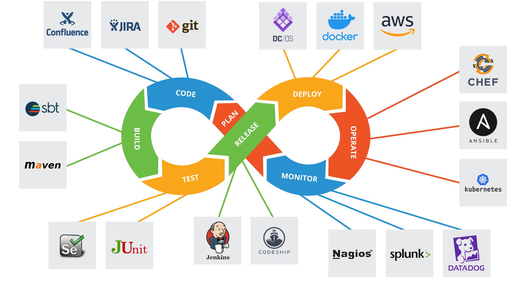
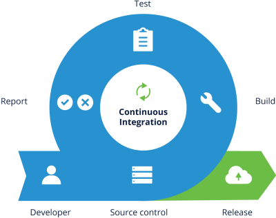
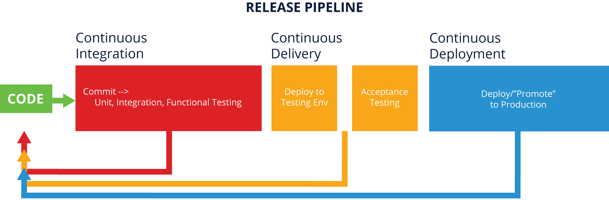

# 10. DEVOPS FUNDAMENTALS
## Introduction
### Chapter Overview

In the past, software developers used to do their engineering in somewhat of a vacuum, and then throw their product over the wall to people in IT to figure out how to deploy the product in production environments. This disconnect often meant that products were difficult to reliably install and operate. DevOps was one answer, designed to bring software developers into the world of IT Operations and IT Operations into the world of software developers. This better connection has resulted in software products that were easier to deploy and better met needs.

Today, by using DevOps methods and Agile project management (discussed in the next chapter), products are continually developed, tested, and deployed in both test and final production environments. These “mini releases” allow software developers, IT Operations and end-customers the opportunity to evaluate the software or new features and provide feedback that can be quickly turned into a better product for all involved.

In this chapter, we will explain what DevOps is and how it improves the overall quality of the resulting software product.

### Learning Objectives
 
By the end of this chapter, you should be able to:

- Understand what DevOps is.
- Discuss basic practices of DevOps.
- Explain how cloud and containers help with implementing DevOps practices.
- Understand general DevOps environments.
- Use Git fundamental commands.

## DevOps Basics
### What Is DevOps?

As the computing environment evolved over time, the traditional model of developing monolithic applications has given way to a more flexible and scalable model. DevOps is a set of practices that combines software development (Dev) and IT operations (Ops). It aims to shorten the systems development life cycle and provide continuous delivery with high software quality. DevOps methods complement Agile software development (which we will discuss in the following chapter); several DevOps aspects came from the Agile methodology.

DevOps combines cultural philosophies, practices, and tools that increase an organization's ability to deliver applications and services at high speeds. Products will evolve and improve at a faster pace than organizations using traditional software development.

There are seven practices in this new approach:

- Configuration management
- Continuous integration
- Automated testing
- Infrastructure as Code
- Continuous delivery
- Continuous deployment
- Continuous monitoring

### Configuration Management

[Configuration management (CM)](https://www.upguard.com/blog/5-configuration-management-boss) is the practice of controlling and managing changes to software using version control in a standard and repeatable way. The practice has two components to it:

- Using versioning control software
- Using a standard code repository management strategy (which defines the process for branching, merging, etc.).

Within the Linux development environment, we have several choices of versioning control software, but, by far, the primary choice is git, which we will discuss later in this chapter.

### Continuous Integration

[Continuous integration (CI)](https://www.thoughtworks.com/continuous-integration) is the practice that requires developers to integrate code into a shared repository often and obtain rapid feedback on its success during active development of a product. This is done as developers finish a specific piece of code and it has successfully passed unit testing. CI also means creating a build using a tool like **Bamboo**/**Jenkins**/**GitLab** that runs after developer code check-in, runs any test you have that can run on this build (unit and integration tests, for example), and provides feedback to the development team if it worked or failed. The goal is to create small workable chunks of code that are validated and integrated back into the centralized code repository as frequently as possible. CI is the foundation for both continuous delivery and continuous deployment DevOps practices, that we discuss later in this chapter.

 

### Automated Testing

[Automated testing](https://smartbear.com/learn/automated-testing/what-is-automated-testing/) is the practice of using software to control the execution of software tests and the comparison of the results. Automation is relied upon to reduce the burden of running repetitive tests manually, to speed up the execution of the testing process, and to allow the execution of difficult tests. These automated tests are usually run during the CI build, as well as when needed. The tests to be automated are unique to the maturity and needs of each program and should be determined on a case-by-case basis.

 

### Infrastructure as Code

[Infrastructure as Code (IaC)](https://stackify.com/what-is-infrastructure-as-code-how-it-works-best-practices-tutorials/) is used to define code that when executed, can create an entire physical or virtual environment, including computing and networking infrastructure. It is a type of IT infrastructure that operation teams can automatically manage and provision through code, rather than using a manual process. An example of using IaC would be to use a tool like [Chef](https://www.chef.io/), [Puppet](https://puppet.com/), or [Ansible](https://www.ansible.com/) to rapidly create nodes in a cloud environment, and then have the ability to destroy and rebuild the environment consistently each time. Doing so gives the user the ability to version control their infrastructure. This is where cloud technologies have significantly helped with providing DevOps environments for building, testing and deploying new iterations of developing product such as an application.

 

### Continuous Delivery

[Continuous delivery](https://aws.amazon.com/devops/continuous-delivery/) is the practice of making every change to source code ready for a production release as soon as automated testing validates it. This includes automatically building, testing and deploying. An approach to code approval and delivery approval needs to be in place to ensure that the code can be deployed in an automated way with appropriate pauses for approval depending on the specific needs of a program.

 

### Continuous Deployment

[Continuous deployment (CD)](https://www.atlassian.com/continuous-delivery/continuous-deployment) is the practice that strives to automate product deployment from start to finish. In order for this practice to be implemented, a team needs to have extremely high confidence in their automated tests (see the "Automated Testing" page). The ultimate goal is that as long as the build has passed all automated tests, the code will be deployed. Manual steps in the deployment process can be maintained if necessary. For example, a team can determine what type of changes can be deployed to production in a completely automated fashion, while other types of changes may require a manual approval step.

 

### Continuous Monitoring
 
[Continuous monitoring](https://www.sumologic.com/glossary/continuous-monitoring/) is the practice of proactively monitoring, alerting, and taking action in key areas to give teams visibility into the health of the application in a production environment. As source code and binaries flow through the system, there are several points where things can go wrong and need to be monitored and potentially corrected. A bad check-in or merge of source code may need to be manually corrected. A failed build of the product needs to be corrected so that a proper build of the software product is produced. Test failures at the unit and system level need to pass or be corrected with source code modifications. Infrastructures used for testing and eventual deployment may change as features are added and code changes. Deployment into a test production or final production environment needs to be monitored and modified if it does not reflect the environments needed to support the product or new features are added to the product during its lifecycle. All of these steps require a watchful eye to ensure the right product is being delivered with high quality.

## Containers

### The Use of Containers in DevOps
 

## Deployment Environments

### What Makes a Total Deployment System?
 

## Git Concepts
### Git Fundamentals

 

### Working with Git

 

### Git Best Practices