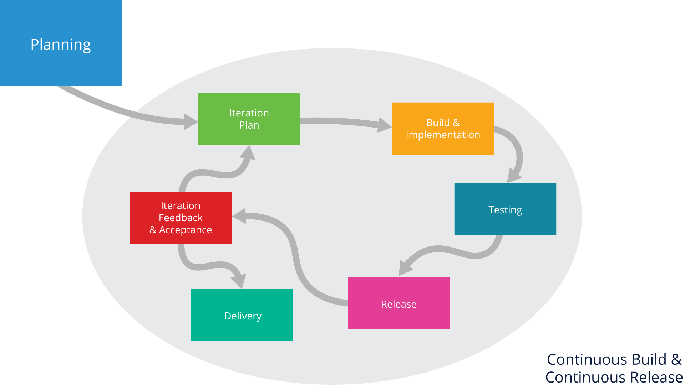
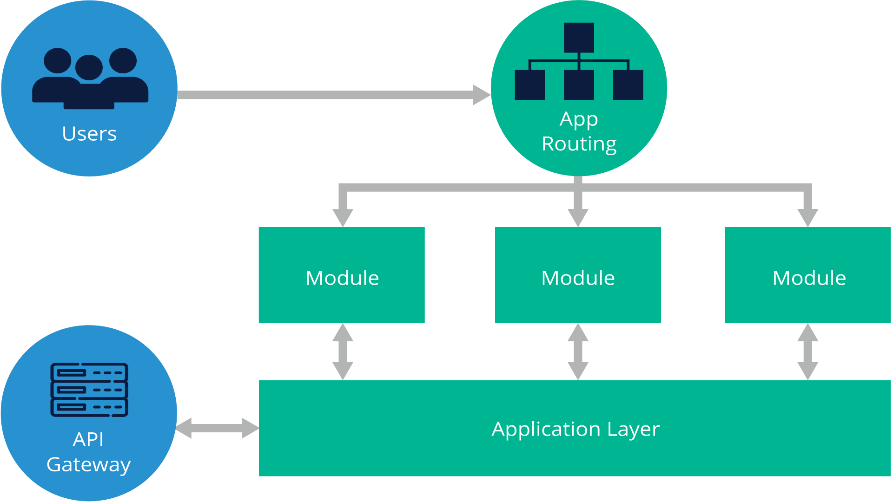
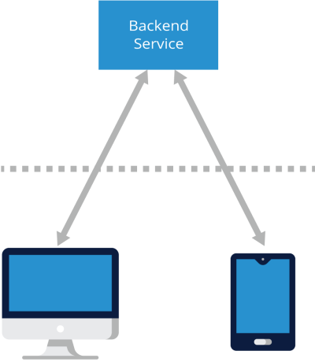

# 11. SUPPORTING APPLICATIONS AND DEVELOPERS
 
## Introduction
### Chapter Overview

The [Software Development Life Cycle (SDLC)](https://www.tutorialspoint.com/sdlc/sdlc_overview.htm) defines a process that starts with the definition of the problem that needs to be solved, the design of a solution, the testing of that solution and ends with the final solution in production. Of course, things can change over time and flexibility is necessary to adapt to evolving problems. The SLDC is designed to account for the ever changing landscape of software development.

A career in Information Technology will certainly involve some form of specifying the problems that need a solution, designing, coding, testing, deploying, or maintaining software solutions. At some point in your career, you will be involved in a software project that will require Project Management to bring it from start to finish.

### Learning Objectives
 
By the end of this chapter, you should be able to:

- Discuss two of the popular project management methods in use today.
- Understand that design patterns can be used by software developers to architect their applications.
- Understand what open source software is.
- Know some of the popular open source software licenses and their differences.

## Software Project Management
### Software Project Management Overview

According to the [Project Management Institute (PMI)](https://www.pmi.org/about/learn-about-pmi/what-is-project-management), 

> Project management is the use of specific knowledge, skills, tools and techniques to deliver something of value to people. The development of software for an improved business process, the construction of a building, the relief effort after a natural disaster, the expansion of sales into a new geographic market—these are all examples of projects.

While there are different forms of project management, software development is currently using two popular forms of project management:

- Waterfall or Sequential project management 
- Agile or Iterative project management.

Other methods exist, but are not nearly as popular in software development.

### Waterfall or Sequential Project Management

In [Waterfall or Sequential project management](https://www.guru99.com/what-is-sdlc-or-waterfall-model.html), there are clearly defined steps or phases of project management that must be accomplished to move on to the next phase. The term “waterfall” is used to represent the notion that one phase (or pool of water) needs to complete before the effort (or water) falls into the next phase (or pool of water as it cascades down a multi-tiered waterfall). As the name implies, the phases are sequential. This form of project management relies heavily on front-end effort to clearly specify the problem to be solved, a very detailed solution for that problem, and ample documentation that can be followed by software developers to implement the solution. Planning starts with gathering [functional requirements](https://www.nuclino.com/articles/functional-requirements) (what will the program do and look like?) for the resulting program (scope). Once these are set, the technical teams determine what resources (budget, people and machines) they will need in order to satisfy the requirements in design, implementation, and testing. A schedule is also determined for each step. Development will report how long it will take them to design and implement a program to satisfy the requirements. Quality Assurance will report how long it will take them to fully test the program. Usually, some [slack time](https://www.productiveedge.com/2015/06/29/slack-time-the-nature-of-the-beast/) is figured into the schedule, but often, unforeseen things happen that cause the schedule to slip, delaying the finish of the project. Sometimes, changes in requirements happen after work has been designed and started, which usually means that the schedule will slip. Sometimes, resources change (people leave projects or machine resources aren’t available); this, too, affects the delivery date. Waterfall project management depends very heavily on well-defined requirements, stable resources, and a reasonable schedule.

**Waterfall development phases**

### Common Issues With Waterfall Project Management

At the start of the project, a problem is defined and requirements for the solution are specified. The thing is, most problems are messy and difficult to clearly define. Requirements will often vary depending on who you ask. The people involved in the specification of the requirements and solution are called stakeholders. Often, new stakeholders appear during the lifecycle of the project that we don’t know about at the beginning of the project. This means that the scope of the project often changes as we bring in new stakeholders or as current stakeholders think more about the problem and solution. A schedule is developed as to when a project will pass from one phase to the next phase; these are called project deadlines. As often happens, the internal deadlines may be pushed back, but the project’s final deadline does not change. This starts to compress work that needs to happen in some of the later phases, such as testing. Oftentimes, the project’s release date slips and people are disappointed. In addition, costs for resources for the project grow and the project can be both late and over budget.

As soon as a deadline is missed, the blame starts being assigned. Because project assets usually work independently, it is easy to show that certain tasks could not be completed until others were done. Ultimately, however, it is the Project Manager who must answer for the delays and overspending.

Smaller projects or projects that are extremely well defined are successful with sequential project management. Most complex software projects do not perform well with this method of project management.

### Agile or Iterative Project Management
 
Imagine working with a Project Manager that promises no negative fallout from failure and exemption from personal blame. Would you want to work with him or her? The offer goes further to allow you to be embedded in a team that has all the necessary professionals needed to complete the project. The Project Manager offers to assist you every day, and even keeps track of your progress for you, and presents updated collaboration documents in a short daily project progress meeting (usually 10-15 minutes)! This sounds too good to be true for anybody who has only ever worked with traditional Project Managers, but this sounds familiar and common to anybody who has worked in an organization that has adopted and applied Agile principles.

[Agile or Iterative project management](https://www.tutorialspoint.com/sdlc/sdlc_agile_model.htm) starts out the planning phase by specifying functional requirements, but not all requirements need to be defined at the start of the project. As new requirements are thought of, they are added to the project, but the development team only develops small chunks of software that solve parts of a problem, satisfying only some of the requirements at a time.

**Agile Project Management Steps**

Requirements are broken down into items that can be implemented within a defined period of time called a [sprint](https://www.wrike.com/project-management-guide/faq/what-is-a-sprint-in-agile/). Often, a sprint is between one and four weeks in duration, but the length can vary depending on the project and the team. Requirements are prioritized and effort to implement them is decided by the developers who are going to implement them. A few requirements are implemented in each sprint. The idea is for the team of developers to produce something that works during a sprint. The stakeholders can then look at what was produced, knowing it only addresses some of the solution, and provide feedback. Perhaps some stakeholders don’t like the user interface or there was some confusion about a requirement that needs to be clarified. At this stage in the development, changes can be easily made. If new requirements are generated, they are broken down, prioritized and sized in terms of effort to fit into a near-future sprint; this is known as the [backlog](https://www.agilealliance.org/glossary/backlog/). This feedback loop can go on for a long time. The idea is to release updates as often as possible, each time getting incrementally closer to the finished product.

Agile project management follows [12 principles](https://www.agilealliance.org/agile101/12-principles-behind-the-agile-manifesto/) of software development that you can explore if you wish to drill down deeper.

If this sounds a bit like the DevOps system we talked about in the previous chapter, DevOps was developed after Agile project management to fit the iterative process found in Agile; keep in mind that DevOps is not a project management method.

## Software Application Architecture
### Frontend Architecture

[Frontend developers](https://selleo.com/blog/who-is-a-front-end-designer) work on the user interface, ensuring a good user experience with a great visual design and the code to implement it. This may be through a web interface, or some kind of [graphical user interface (GUI)](https://www.omnisci.com/technical-glossary/graphical-user-interface). Common programming languages used by frontend developers include [HTML](https://html.com/), [CSS](https://developer.mozilla.org/en-US/docs/Web/CSS), and [JavaScript](https://javascript.info/). Frontend developers often use a [frontend framework](https://stackoverflow.blog/2020/02/03/is-it-time-for-a-front-end-framework/) to aid in their development. This framework includes ways to structure files, make requests to servers, format your interface components (for example, buttons, selection boxes, etc.), and associate data with functions. Frameworks allow for [reusable user interface components](https://dev.to/crinklesio/how-to-create-a-scalable-and-maintainable-front-end-architecture-4f47) that aid in quick construction and maintenance if something needs to change. The [frontend architecture](https://medium.com/js-dojo/modern-frontend-architecture-101-f9c88c20ea20) addresses how the user of the application will interact with the application. Sometimes, the frontend will mimic a form previously seen on paper. Or, it might represent controls laid out in a similar manner to a control panel that the users of this application are already familiar with. If the users of an application cannot comfortably and intuitively interact with it, the application is not of much use; there will be a natural aversion to using the new application. The frontend may be running through a web page, or it may be an app on a mobile telephone or tablet, but in all cases, it provides the requests that are then serviced by the backend.

 

**Frontend architecture: interfaces with users of the application**
Retrieved from the [How to create a scalable and maintainable front-end architecture](https://laptrinhx.com/how-to-create-a-scalable-and-maintainable-front-end-architecture-3542080245/) article:
 

### Backend Architecture

On the backend side of the application, there is code running on a server, or multiple servers, in some cases. The server application receives requests from clients, usually coming from the frontend architecture, and sends data back to those clients. A [backend architecture](https://hackernoon.com/an-introduction-to-backend-architecture-541g3zze) designed application may need to interface with a database to look up and persistently store data; the database server is another one of the servers on the backend. Similar to frontend developers, backend developers use frameworks to quickly establish methods to respond to the frontend requests. A couple of examples of frameworks used include [Ruby](https://stackify.com/ruby-frameworks/) and [Express](https://www.tutorialspoint.com/nodejs/nodejs_express_framework.htm). Responses from the backend can be in many forms. A request could come in that results in HTML, data in various forms from a database, or even some kind of error code for information that is not available.

Together, the frontend and the backend work to provide services in forms that are easy to use by the people having to use it. It is this attention to both the frontend for ease of use, and the backend for efficiency and reliable services that make a properly architected product work so well for customers and businesses.

### Design Patterns

An application architecture also describes the patterns and techniques used to design and build an application. Software design patterns can help you build an application. A pattern describes a repeatable solution to a problem. Patterns can be linked together to create more generic application architectures. There are several design patterns available for software developers. These design patterns simplify the solution for problems and let the developer leverage methods to solve complex problems in known ways that can be understood by others adding to, or maintaining the application. Some of the software design patterns include (with links to Wikipedia for more information, if desired):

- [Client-server](https://en.wikipedia.org/wiki/Client–server_model) (2-tier, 3-tier, [n-tier](https://en.wikipedia.org/wiki/N-tier), [cloud computing](https://en.wikipedia.org/wiki/Cloud_computing) exhibit this style)
- [Component-based](https://en.wikipedia.org/wiki/Software_componentry)
- [Event-driven](https://en.wikipedia.org/wiki/Event-driven_architecture) (or [implicit invocation](https://en.wikipedia.org/wiki/Implicit_invocation))
- Layered (or [multilayered architecture](https://en.wikipedia.org/wiki/Multilayered_architecture))
- [Microservices architecture](https://en.wikipedia.org/wiki/Microservices)
- [Monolithic application](https://en.wikipedia.org/wiki/Monolithic_application)
- [Peer-to-peer](https://en.wikipedia.org/wiki/Peer-to-peer) (P2P)
- [Representational state transfer](https://en.wikipedia.org/wiki/Representational_state_transfer) (REST)
- [Rule-based](https://en.wikipedia.org/wiki/Rule-based_system)
- [Service-oriented](https://en.wikipedia.org/wiki/Service-oriented_architecture).

## Open Source Software and Licensing
### Open Source Software Overview

Open source software (OSS) is software that is distributed with its source code, making it available for use, modification, and distribution with its original rights. [OSS must meet ten requirements](https://opensource.org/osd):

- Free redistribution
- Include the source code
- Allow for modifications and derived works
- Integrity of the original author’s source code
- Does not allow discrimination against persons or groups
- Does not allow discrimination against any fields of endeavor
- Distribution of the original license
- License must not be specific to any product
- License must not restrict other accompanying software
- License must not be predicated on any technology or style of interface.

OSS typically includes a license that allows programmers to modify the software to best fit their needs and control how the software can be distributed. [Open source licenses](https://opensource.org/licenses) are legal and binding contracts between the author of the software and the user of a software component, declaring that the software can be used in commercial applications under specified conditions. Specifically, open source licenses are licenses that comply with the open source definition (see above). Briefly, they allow software to be freely used, modified, and shared.

There are also other kinds of downloadable software that are not open source, and they must be accounted for. These other types of software include:

- Shareware or Free Trialware, which is downloadable software with commercial terms that actually can involve payments under various circumstances
- Any other software that does not allow free redistribution as part of another program, for example, perhaps, one of your organization’s products.

### Software Licenses

[Public domain](https://wiki.creativecommons.org/wiki/public_domain) is the most permissive type of software license; anyone can modify and use the software without any restrictions.

[Permissive licenses](https://en.wikipedia.org/wiki/Permissive_software_license) contain minimal requirements about how the software can be modified or redistributed. Those requirements are typically limited to things like retaining or delivering attribution notices. Because requirements are minimal, it is often easier for permissively-licensed software to be combined with restrictively-licensed software, but there are compatibility issues in some cases. Permissive licenses are perhaps the most popular licenses used with free and open source software.

A restrictive license, sometimes called a protective or reciprocal license, means users must abide by some strict rules and requirements for how the software can be redistributed, as well as requirements that may impact how derivative works can be distributed. Restrictive licenses require all code modifications to the licensed software to be released under the same license. A [copyleft license](https://fossa.com/blog/all-about-copyleft-licenses/) is one example of a restrictive license. 

[Proprietary licenses](https://en.wikipedia.org/wiki/Proprietary_software) are the most restrictive. All rights are reserved. With proprietary software, work may not be modified or redistributed.

### Common Open Source Licenses

Let's now take a closer look at some common open source licenses. The GNU General Public License (or GPL) has two current versions: 2 and 3. GPLv2 is a strong copyleft license, which covers entire programs. The Linux operating system (the Kernel code), for example, is currently covered by the GPLv2 license. The details of the GPLv2 license can be found [here](https://opensource.org/licenses/GPL-2.0).

GPLv3 is the most recent version of the GPL license, but both versions are available to be used. Like the GPLv2, GPLv3 is a strong copyleft license, meaning that any copy or modification of the original code must also be released under GPLv3. You can take GPLv3 licensed code, add to it or make major changes, then distribute your version. However, your version is subject to the same license requirements, meaning that it must be under GPLv3 as well. This means that anyone can see your modified code and install it for their own purposes. GPLv3 further includes an explicit grant of patent rights. This means that the creator or contributor to the original licensed code essentially gives away their patent rights with regard to any subsequent reuse of the software. You cannot challenge someone who uses your code in a court of law for patent infringement. GPLv2 generally discusses patent rights, but GPLv3 clearly states the grant of patent rights in the text of the GPLv3 license.

If a developer uses software components from two different licenses to build a product, if the licenses are compatible (the software components can legally be distributed together), there is no problem, and the developer can distribute the resulting code/program using the stronger license. For example, GPLv2 is not compatible with the Apache 2.0 license, which we will discuss next. GPLv3 is compatible with the Apache 2.0 license. However, this compatibility only works one way. Code that is licensed under the Apache 2.0 license and combined with code licensed under the GPLv3 license would be licensed under the GPLv3 license. It doesn’t matter if the majority of code is licensed under the Apache 2.0 license; the resulting code must be licensed under the GPLv3 license.

An example of software currently licensed under GPLv3 is Ansible, the IT automation tool sometimes used with DevOps. The details of the GPLv3 license can be found [here](https://opensource.org/licenses/GPL-3.0).

In contrast with the GPL, the Apache 2.0 license is what is called a permissive license. This means that users can do (nearly) anything they want with the code, with very few exceptions. If you make any major modifications to the licensed code, you must disclose those changes in any updated version that you distribute. You do not need to release the modified code under the Apache 2.0 license. Simply including any modification notifications is enough to comply with the license terms. Under the Apache 2.0 license, you can use the code commercially, alter the code, distribute any copies or modifications of the code, sublicense the code, and even place warranties on the licensed software if desired. An example of software that is licensed under the Apache 2.0 license is Kubernetes. Other permissive popular open source licenses include MIT and BSD. Various code developers select the license that they feel most comfortable with. The Apache 2.0 license in very detailed legal terms can be found [here](https://opensource.org/licenses/Apache-2.0).

To learn more about open source licensing, we recommend the free course ["Open Source Licensing Basics for Software Developers" (LFC191)](https://training.linuxfoundation.org/training/open-source-licensing-basics-for-software-developers/?_gl=1*16r6upl*_ga*NTc4MTQ1MjAyLjE3MDMzNjgzNDk.*_ga_EMX7DDZMX4*MTcwMzYwODE5Mi4xMC4xLjE3MDM2MDgyNjIuNjAuMC4w) offered by the Linux Foundation.
