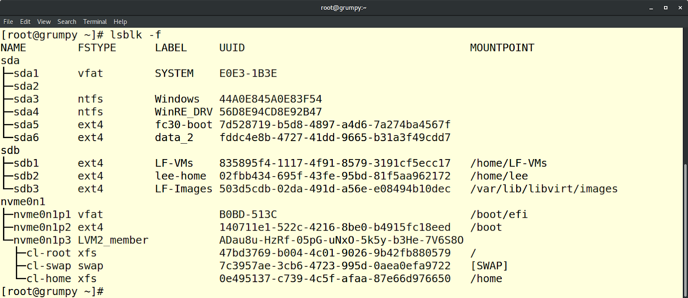
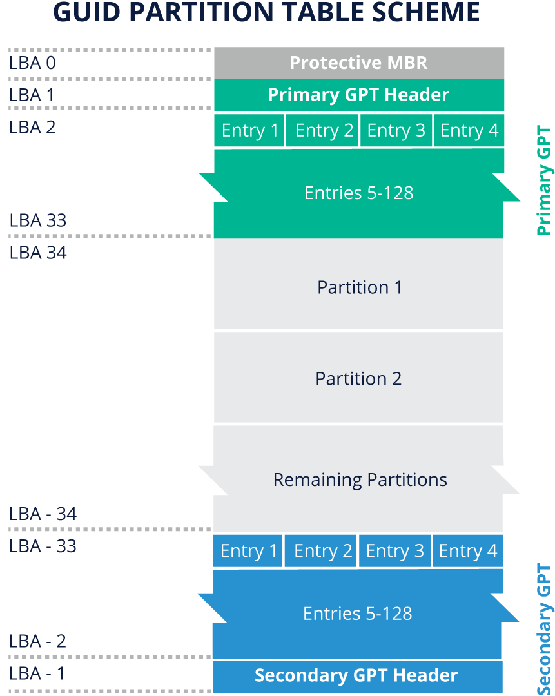

# LINUX FILESYSTEMS AND FILE MANAGEMENT

## Introduction
- **Chapter Overview**

    An administrator needs to understand the basic filesystem functions and administration to be able to manage the storage on a system and add new storage. In this chapter, we will take a look at Linux filesystems and file management.

- **Learning Objectives**

    By the end of this chapter, you should be able to:

    - Explain what a filesystem is.
    - Discuss how a filesystem is used in Linux and understand the filesystem hierarchy.
    - Create new filesystems.
    - Partition new disk drives.

## Filesystems
- **What Is a Filesystem?**

    A filesystem is a software construct to manage the storage in a partition, regardless if the partition is contained in a virtual disk, physical disk, or Logical Volume (according to the [Ubuntu wiki](https://wiki.ubuntu.com/Lvm), logical volumes correspond to partitions: they hold a filesystem​​). A Linux system reads and writes files unlike other systems that are "[disk sector](https://www.lifewire.com/what-is-a-sector-2626003)"-oriented. The read or writes initiated by the user or user program are sent to the VFS ([Virtual Filesystem](https://en.wikipedia.org/wiki/Virtual_file_system)) layer on the way to the device driver. The advantage to the VFS layer is the user environment sees all filesystems the same, a device to read and write, while the filesystem organizes the disk and maintains the appropriate control structures.

    The filesystem does all the hard work, not the user. In general terms, the filesystems have control blocks that are associated with files. The control blocks keep the file metadata, such as filename, permissions, owner, access time, creation time, and more. These control blocks are commonly known as index nodes or, simply, inodes. The inodes also point to the data blocks used by the file. There is a finite amount of space in an inode, so there may be intermediate pointer blocks to allow for more blocks; this is known as “indirect block pointers”. Large numbers of indirect blocks or levels of indirection may be used.

    This type of filesystem is a little fragile if the system were to crash, as many of the filesystem components are cached in memory. An option that most filesystems have is what is commonly known as journaling. This filesystem level function writes information to a “journal” first, then writes the data to the correct location in the filesystem, and if that process is complete, the journal is released and the next operation is started. Journaling of the metadata is highly recommended in almost every environment.

    You can see an example of data blocks in an inode in the image below:

    


- **Filesystem Types**

    Filesystems come in many flavors; some of them are listed in the table below.

    |FILESYSTEM TYPE | DESCRIPTION|
    |---|---|
    |**FAT**, **VFAT**, **FAT32** | Older types, compatible with most operating systems. They have limited capabilities.|
    |**EXFAT**|	The latest in the FAT (File Allocation Table) family.|
    |**ext2**, **ext3**|	These are older versions of the ext (extended) filesystem family. This used to be a native filesystem in Linux. It is still supported.|
    |**ext4**|	The current default filesystem on many Linux distributions. It is backward-compatible with ext2 and ext3. Has improvements in volume size and journaling.|
    |**XFS**|	This is a high-performance journaling filesystem. Fast recovery with large file size support. |
    |**NTFS**|	This is a proprietary journaling filesystem developed by Microsoft, and is a replacement for FAT filesystems.|
    |**btrfs**|	This is a modern filesystem for Linux, aiming to implement advanced features while focusing on fault tolerance, repair and easy administration. Ongoing development of its features.|

- **Device Names**

    Device names are connected to the operating system through Kernel modules, and have the following general parameters, as seen below.

    **/dev/xxyn**, where:

    - **xx** is the type of device (**sd** = scsi, **hd** = ide, **vd** = virtual disk, etc.)
    - **y** is a letter indicating the discovery order (**sda** = first, **sdb** = second, etc.)
    - **n** is the partition number ('missing' = whole disk, **1** = first partition, **2** = second partition, etc.)

    You can see some examples of filesystem device identifiers in the table below:

    |Device Name| Device Type|
    |---|---|
    |**/dev/fd0 ... /dev/fd1**|Floppy disk, first and second|
    |**/dev/sda ... /dev/sdb**|Device using the SCSI driver (e.g., USB), first and second|
    |**/dev/nvme0n1p1**|NVMe SSD (Non-Volatile Memory extended Solid State Disk). For more details, check out the official [NVM Express website](http://nvmexpress.org/)|
    |**/dev/vda ... /dev/vdb**|Virtual disk|
    |**/dev/xvda**|Xen virtual disk|

    Most devices are described in the [Linux Kernel User's and Administrator's Guide](https://www.kernel.org/doc/html/latest/admin-guide/devices.html).

    As noted, the disk name is assigned at initialization time. The system usually assigns the same name to the same device because the device is discovered in the same sequence each boot. However, if a change occurs with the number of devices, the name may be different.

    Filesystem labels are used to easily identify and assign filesystems. They can be up to 16 characters long. One disadvantage with using filesystem labels is that there is no "duplicate" checking, which can lead to confusion. There is another option to positively identify a filesystem, using the UUID (Universally Unique IDentifier), a 128-bit number with a high probability of uniqueness in time and space.

    The screenshot below shows multiple disks with partitions, labels, UUID's and [mount points](https://opensource.com/life/16/10/introduction-linux-filesystems#:~:text=A%20mount%20point%20is%20simply,but%20this%20is%20less%20common.).

    


## Storage Management and Configuration
- **Storage Management and Configuration**

    Disk drives have had partitions on them since the early IBM PC days. A partition is a division of a hard drive disk (HDD) into logically independent sections. The original requirement for a partition was to divide the disk into smaller chunks because the filesystem at the time could not consume the whole disk. The choices back then either used a 3rd party format tool or partitioned the disk into smaller pieces. It was common to use partitions, and the operating systems at that time supported up to four partitions. This partitioning scheme is known as **MBR (Master Boot Record)**. Over time, the maximum of four partitions became a limiting factor; as such, extensions to the partitioning scheme were made: three [primary](http://www.linfo.org/primary_partition.html) partitions and one extended partition, where additional logical partitions could be created inside. All partitions greater than four are logical partitions (meaning contained within an extended partition). There can only be one extended partition, but it can be divided into numerous logical partitions. The maximum partitions per disk are still with us and documented in the [“Kernel Administration Guide”](https://www.kernel.org/doc/html/v4.11/admin-guide/devices.html).


    ### Table MBR Scheme
    |PARTITION TYPE (PC-DOS)|	DESCRIPTION|
    |---|---|
    |**Primary**|	A primary partition can contain one filesystem or logical drive. Swap and boot are usually considered primary partitions.|
    |**Extended**|	An extended partition can contain several filesystems (logical drives) inside it. It has another partition table.|
    |**Logical**|	A logical partition is limited by the device type.|

    This MBR partitioning scheme still exists today. However, there is a new partitioning scheme called [GPT](https://en.wikipedia.org/wiki/GUID_Partition_Table) (GUID Partition Table), where GUIDs are Globally Unique IDentifiers. The GPT can have up to 128 partitions per disk and is preferred in systems with a [UEFI](https://en.wikipedia.org/wiki/Unified_Extensible_Firmware_Interface) (Unified Extensible Firmware Interface), the replacement for PC-BIOS. Partitions help us section our storage drive into logically separate drives. This enables us to apply special parameters to sub-sections of the disk for security, performance, and other options.

    


- **Disk Formatting Utilities**

    Several tools or utilities can be used to create and/or manipulate device partition tables and partitions. You can see some of these tools in the table below.

    | UTILITY | TYPE | COMMENTS |
    |---|---|---|
    |**fdisk**|	text |	Menu-driven partition table editor. It is the most standard and one of the most flexible partition table editors. Usually installed. The **fdisk** command-line utility provides disk-partitioning functions, preparatory to defining filesystems. **fdisk** is used to create, modify, and delete partitions. You can create a new partition table or modify an existing one. As with any other partition table editor, make sure that you either write down the current partition table settings or make a copy of the current settings before making changes.|
    |**sfdisk**|	text |	Non-interactive Linux-based partition editor program, making it useful for scripting. Usually installed. You should use this tool with care!|
    |**parted**|	text |	The GNU partition manipulation program. It can create, remove, resize, and move partitions (including certain filesystems). Optional|
    |**gnome-disks**|	graphical |	The command to launch the GNOME Disks application, which provides a way to inspect, format, partition and configure disks and block devices.|
    |**gparted**|	graphical |	Widely-used graphical interface to **parted**. Optional package.|

    <br>
    
    ***NOTE:***

    To partition devices, you should use a partitioning tool that is compatible with the chosen type of partition table. Using incompatible tools may result in the destruction of that table, along with existing partitions or data.
    

- **Formatting a Disk and Adding a Filesystem**

    To format a new disk and add a filesystem, you will need an additional disk.
    - **Using a Virtual Machine (VM)**

        The VM management application will allow for the creation of another virtual disk and, if necessary, the virtual adapter to connect the virtual disk.

    - **Using a Real Machine**

        In most cases, there is no free space on the installed system to add another partition. As such, experimenting with a real machine may lead to unforeseen challenges. The test environment is to use a USB key. The size of the USB key is not a concern; an old one works fine. Please remember the contents of the USB will be lost.

    - **Using a Virtual Machine and a USB Key**

        Most VM environments will allow control transfer from the real machine to the VM when the USB is connected. This is also an excellent option.

    <br><br>
    **Next, we will provide an example using an old USB key on a VMware virtual machine.**
    1. List the existing disk structures as a baseline:
        ```shell
        sudo lsblk -f | grep -v loop
        ```
        ```
        NAME  FSTYPE  LABEL  UUID                                  FSAVAIL  FSUSE%  MOUNTPOINT
        sda
        ├─sda1 vfat          7BE6-4C07                                511M      0%  /boot/efi
        ├─sda2
        └─sda5 ext4          d5faafb5-02d9-4b8a-97b5-6798fac19adb     2.2G     71%  /
        sdb
        sdc
        sdd
        sr0
        ```

    2. Insert the USB key, read and acknowledge any messages that pop up.
    Then, check the disks again.
        ```shell
        sudo lsblk -f | grep -v loop
        ```

        ```
        NAME   FSTYPE   LABEL                  UUID                                 FSAVAIL FSUSE% MOUNTPOINT
        sda
        ─sda1  vfat                            7BE6-4C07                               511M     0% /boot/efi
        ├─sda2
        └─sda5 ext4                            d5faafb5-02d9-4b8a-97b5-6798fac19adb    2.2G    71% /
        sdb
        sdc
        sdd
        sde    iso9660  Fedora-WS-Live-25-1-3  2016-11-15-22-03-09-00
        ├─sde1 iso9660  Fedora-WS-Live-25-1-3  2016-11-15-22-03-09-00                     0   100% /media/student/Fedora-WS-Live-25-1-3
        ─sde2  vfat     ANACONDA               6007-F982
        └
        ─sde3  hfsplus  ANACONDA               1c2eb970-8839-3b51-9555-1d17a206366b
        sr0
        ```

    3. This system may have additional information, but the purpose is to find the newly plugged-in USB disk. Notice in step 2 there is an **sde** disk with several partitions; this is typical of an old USB key.

    4. This old USB key has its partitions mounted; notice the **MOUNTPOINT** field. The old partitions need to be unmounted; you can use the following command to unmount old partitions:

        ```shell
        sudo umount /media/student/Fedora-WS-Live-25-1-3
        ```

    5. Do not use the file manager to "eject" the USB key, as the root device (**/dev/sde**) will be removed.


- **Partitioning New Disk Drives**

## Directories and Files
- **Directories & Files**
- **Most Common Filesystem Directories**

## Contents and Finding Files
- **Finding Files**
- **Listing Filesystem Content**