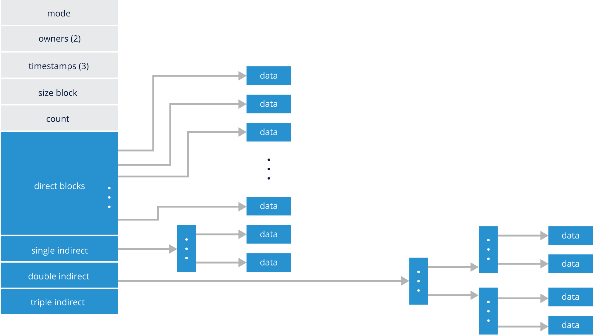

# LINUX FILESYSTEMS AND FILE MANAGEMENT

## Introduction
- **Chapter Overview**

    An administrator needs to understand the basic filesystem functions and administration to be able to manage the storage on a system and add new storage. In this chapter, we will take a look at Linux filesystems and file management.

- **Learning Objectives**

    By the end of this chapter, you should be able to:

    - Explain what a filesystem is.
    - Discuss how a filesystem is used in Linux and understand the filesystem hierarchy.
    - Create new filesystems.
    - Partition new disk drives.

## Filesystems
- **What Is a Filesystem?**

    A filesystem is a software construct to manage the storage in a partition, regardless if the partition is contained in a virtual disk, physical disk, or Logical Volume (according to the [Ubuntu wiki](https://wiki.ubuntu.com/Lvm), logical volumes correspond to partitions: they hold a filesystem​​). A Linux system reads and writes files unlike other systems that are "[disk sector](https://www.lifewire.com/what-is-a-sector-2626003)"-oriented. The read or writes initiated by the user or user program are sent to the VFS ([Virtual Filesystem](https://en.wikipedia.org/wiki/Virtual_file_system)) layer on the way to the device driver. The advantage to the VFS layer is the user environment sees all filesystems the same, a device to read and write, while the filesystem organizes the disk and maintains the appropriate control structures.

    The filesystem does all the hard work, not the user. In general terms, the filesystems have control blocks that are associated with files. The control blocks keep the file metadata, such as filename, permissions, owner, access time, creation time, and more. These control blocks are commonly known as index nodes or, simply, inodes. The inodes also point to the data blocks used by the file. There is a finite amount of space in an inode, so there may be intermediate pointer blocks to allow for more blocks; this is known as “indirect block pointers”. Large numbers of indirect blocks or levels of indirection may be used.

    This type of filesystem is a little fragile if the system were to crash, as many of the filesystem components are cached in memory. An option that most filesystems have is what is commonly known as journaling. This filesystem level function writes information to a “journal” first, then writes the data to the correct location in the filesystem, and if that process is complete, the journal is released and the next operation is started. Journaling of the metadata is highly recommended in almost every environment.

    You can see an example of data blocks in an inode in the image below:

    

- **Filesystem Types**

    Filesystems come in many flavors; some of them are listed in the table below.

    |FILESYSTEM TYPE | DESCRIPTION|
    |---|---|
    |**FAT**, **VFAT**, **FAT32** | Older types, compatible with most operating systems. They have limited capabilities.|
    |**EXFAT**|	The latest in the FAT (File Allocation Table) family.|
    |**ext2**, **ext3**|	These are older versions of the ext (extended) filesystem family. This used to be a native filesystem in Linux. It is still supported.|
    |**ext4**|	The current default filesystem on many Linux distributions. It is backward-compatible with ext2 and ext3. Has improvements in volume size and journaling.|
    |**XFS**|	This is a high-performance journaling filesystem. Fast recovery with large file size support. |
    |**NTFS**|	This is a proprietary journaling filesystem developed by Microsoft, and is a replacement for FAT filesystems.|
    |**btrfs**|	This is a modern filesystem for Linux, aiming to implement advanced features while focusing on fault tolerance, repair and easy administration. Ongoing development of its features.|

- **Device Names**

    Device names are connected to the operating system through Kernel modules, and have the following general parameters, as seen below.

    **/dev/xxyn**, where:

    - **xx** is the type of device (**sd** = scsi, **hd** = ide, **vd** = virtual disk, etc.)
    - **y** is a letter indicating the discovery order (**sda** = first, **sdb** = second, etc.)
    - **n** is the partition number ('missing' = whole disk, **1** = first partition, **2** = second partition, etc.)

    You can see some examples of filesystem device identifiers in the table below:

## Storage Management and Configuration
- **Storage Management and Configuration**
- **Disk Formatting Utilities**
- **Formatting a Disk and Adding a Filesystem**
- **Partitioning New Disk Drives**

## Directories and Files
- **Directories & Files**
- **Most Common Filesystem Directories**

## Contents and Finding Files
- **Finding Files**
- **Listing Filesystem Content**