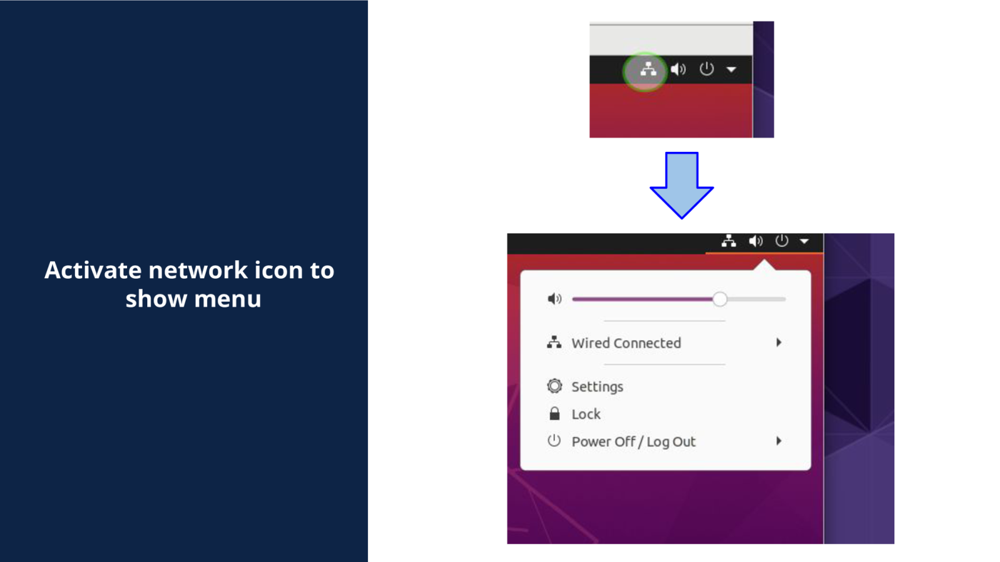
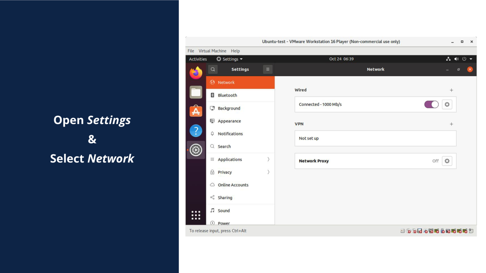
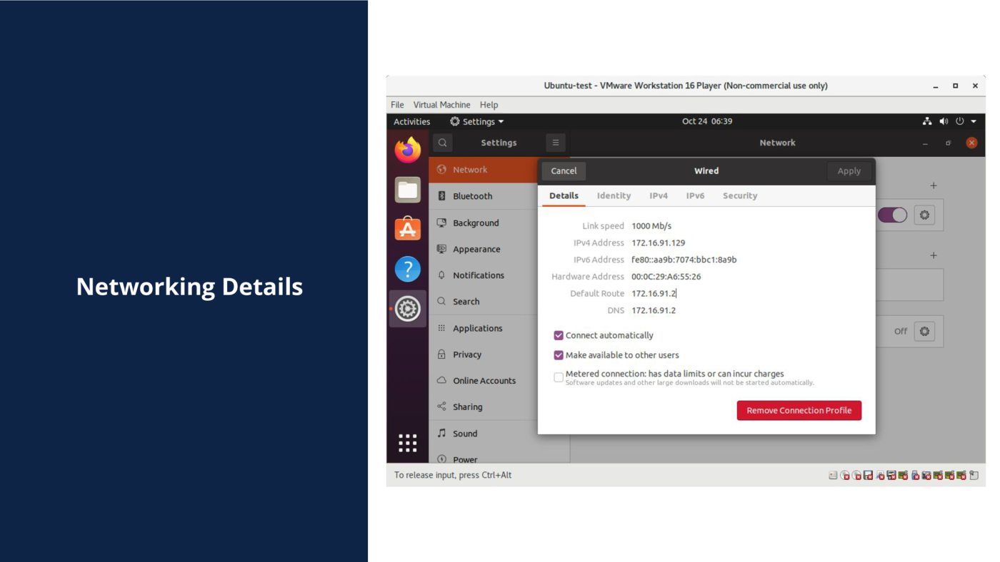
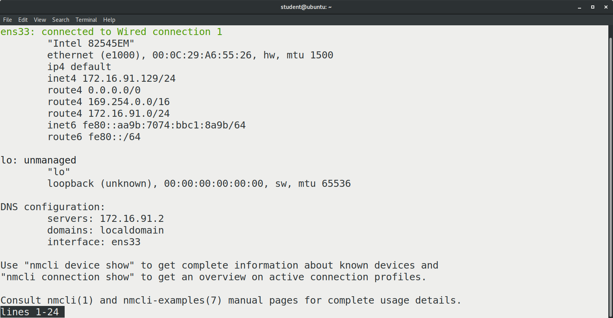
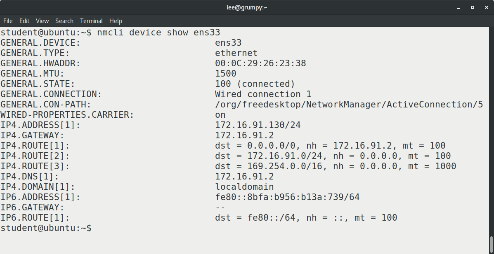
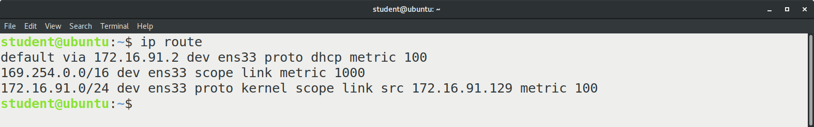
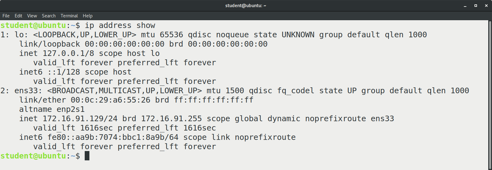
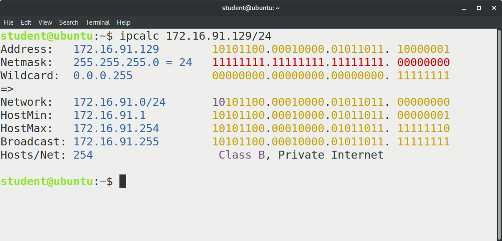

# 7. NETWORKING AND NETWORK TROUBLESHOOTING
 
## Introduction
### Chapter Overview
Networking is a critical component for any computer these days, regardless if the computer connects to the Cloud or Internet. Communication between clients and servers plays a role in almost every computer.

### Learning Objectives
In this chapter, we will take a look at:

- Network configuration using the NetworkManager graphical interface.
- Network observations using the NetworkManager command line interface.
- Network configuration checks with the ip command.
- Network troubleshooting using command line tools.
<br><br>

## Network Configuration
### NetworkManager
**Note:**

A detailed overview of network addressing, networks, subnets, and more can be found in the ["IP Addressing and Subnetting for New Users"](https://www.cisco.com/c/en/us/support/docs/ip/routing-information-protocol-rip/13788-3.html) documentation. We provide a quick overview here.

There are several network configuration applications and commands in Linux; the default network management tool may be different on some Linux distributions. The most common network management application is **NetworkManager**. 

NetworkManager comes in three flavors: 
1. Command line interface (```nmcli```), 
2. Colorized text menu (```nmtui```),
3. Graphical application (```nm-connection-editor```). 

There is usually a desktop applet on the top right of the desktop that will start up the connection editor with additional graphics. The applet also has a wi-fi connection editor built-in to manage wi-fi connections.

Regardless of the tool used for configuration, four items are critical to a functioning network connection. 

- **IP Address**

    The IP address (for example, 172.16.91.129) is like the postal code of your computer. It contains two components: the network part (for example, 172.16.91.129) and the hosts part (for example, 172.16.91.129). The network component determines how many of the bits in the IP address are for network addressing and how many are for devices. The hosts component is a unique number based on the available bits remaining from the network allocation that can be assigned to individual systems or devices. The combination of network and hosts is the IP address.

- **Netmask**

    Netmask is the binary map that dictates the size of the network component and number of hosts. You can think of the address component of an IP address like a house number, where the network portion would be the town name.

- **Default Route**

    The default route is like the train; if access to another address in another town is desired for communication, the information is passed from the local train to the remote train for delivery to a remote town. This routing requires paths to be defined to get to all the different towns and, fortunately, there needs to be only one train track for each town. We call this the default route, which serves all communication destined for “not our town.”

- **DNS Nameserver**

    Rather than train station number and postcode, names can be assigned to towns (domains) plus houses (address numbers) like "store.town", with an additional top layer for management. The finished information would be like "store.town.com".

<br><br>

The task of acquiring addresses and planning the network layout can be time-consuming; fortunately, there is a methodology to automate this process, known as [DHCP (Dynamic Host Configuration Protocol)](https://en.wikipedia.org/wiki/Dynamic_Host_Configuration_Protocol). DHCP can be set up on a small configuration (e.g., your home devices), or a large scale for companies and governments. Most network connection devices, wi-fi access points, routers or firewalls have a DHCP server in them preconfigured by the factory.

Examination of the network configuration is an important task for any administrator. The network can be examined using NetworkManager.
<br><br>

### NetworkManager in Graphics Mode

- **Activate network icon to show menu**

    The Network icon on the top right of a GNOME desktop can be activated to show a menu.
    Opening the Settings will display a list of various options.

<br><br>

- **Open Settings & Select Network**

    Select Network. Network may also be displayed by default.
    Selecting the gear icon inside the Connected box will show the networking details.

<br><br>

- **Networking Details**

    If desired, the networking details can be altered by using the _Identity_, _IPv4_, _IPv6_ and _Security_ tabs.

<br><br>

### NetworkManager Command Line Interface: nmcli

The GUI is just one method to display the networking information; the most common method to get such information is via the command line.

Open a terminal window and type ```nmcli```. The output below is from ```nmcli```, and should match the information previously displayed by the GUI:


In the above screenshot, some elements are not displayed, like the default route or gateway. Notice the first line. The interface name of ```ens33``` may be different on your machine. 

The full output can be displayed with the 
```shell
nmcli device show ens33
```
 command, where ```ens33``` should be replaced with the entry you took note of in the previous section.


<br><br>

### NetworkManager Text User Interface: nmtui

```nmtui``` is a "curses" or a text graphics command. This interface uses the **Arrow**, **Tab** and **Enter** keys for navigation. The ```nmtui``` command supports "most" configuration options, but not all. This utility command is a handy tool in some cases, so explore it as desired.
<br><br>

### The ip Command

```ip``` is a powerful command line utility used to display and manage network information.

In the example shown from ```nmcli```, the IP address is **172.16.91.129**, and the netmask in "[CIDR](https://en.wikipedia.org/wiki/Classless_Inter-Domain_Routing) format" is **/24**, as we will explain shortly. A DNS server is listed as **172.16.91.2**. 

To see the default route information, use the ```ip route``` command:



The ```ip``` command can also show network addressing information, using the ```ip address show```:


<br><br>

### Netmask
Netmask separates the network from the hosts section in the IP address.



In our example the IP address is **172.16.91.129**. This consists of 4 numbers, each of which is 8 bits, so the total address has 32 bits. The netmask is using a CIDR format indicating 24 of the available bits (meaning only the first three numbers, **172.16.91**) are to be used for networks. For additional details, check out this [Network Masks page](https://www.cisco.com/c/en/us/support/docs/ip/routing-information-protocol-rip/13788-3.html#anc6).

Examining our systems a little closer:



In the above screenshot, the IP address is used as input for the ```ipcalc``` command. The address is **172.16.91.129**, the CIDR netmask is **/24**. The netmask can be written as **255.255.255.0**. The wildcard element is a Cisco element, not required in standard servers.  The network is shown as being **172.16.91.0/24**, indicating there are 254 host addresses available. The beginning and end addresses are also provided. The Broadcast address is required for network operations.

<br><br>

### Nameserver

One of the critical concepts is that all the devices on the defined network can communicate with each other directly. Additional information is required if it is desired to communicate somewhere else. As an example, let's try connecting to www.linuxfoundation.org. 

- **The address can be located with the ```host``` command**:

```shell
host www.linuxfoundation.org
```

```
www.linuxfoundation.org has address 23.185.0.4
www.linuxfoundation.org has IPv6 address 2620:12a:8001::4
www.linuxfoundation.org has IPv6 address 2620:12a:8000::4
```

- **The address can also be located using the dig command**:

```shell
dig www.linuxfoundation.org
```
```
; <<>> DiG 9.16.1-Ubuntu <<>> www.linuxfoundation.org
;; global options: +cmd
;; Got answer:
;; ->>HEADER<<- opcode: QUERY, status: NOERROR, id: 21897
;; flags: qr rd ra; QUERY: 1, ANSWER: 1, AUTHORITY: 0, ADDITIONAL: 1 

;; OPT PSEUDOSECTION:
; EDNS: version: 0, flags:; udp: 65494
;; QUESTION SECTION:
;www.linuxfoundation.org.  IN A 

;; ANSWER SECTION:
www.linuxfoundation.org. 5 IN A 23.185.0.4 

;; Query time: 0 msec
;; SERVER: 127.0.0.53#53(127.0.0.53)
;; WHEN: Tue Nov 02 08:40:39 PDT 2021
;; MSG SIZE rcvd: 68
```

The ```host``` command and ```dig``` command both use name resolution or a [nameserver](https://ubuntu.com/server/docs/service-domain-name-service-dns). The example here shows the nameserver from the command ```nmcli device show ens33``` as:

```
IP4.DNS[1]:         172.16.91.2
```

The nameserver can also be manually entered in the interface configuration file or the ```/etc/resolv.conf``` file.

<br><br>

## Network Troubleshooting

When a network fails, the usual complaint is about a specific device or service like "mail is not working" or "the browser is hanging", but a closer examination can find some interesting issues.

There are four major steps to take when troubleshooting the network.

**Network Troubleshooting Steps**:
1. Verify the adapter is active

    In this step, you need to check if the interfaces are plugged in.
    - Is the adapter link enabled?

2. Verify the local configuration

    In this step, verify the configuration for the following:
    - IP address
    - Netmask
    - Routes
    - DHCP client

3. Verify connections

    In this step, check the following:
    - Local system
    - Access default route device
    - Connect to a known good host by name


4. Verify server functions

    - Verify daemons are active
    - Correct port is opened
    - Use localhost for function check
    - Check firewall


One of the first decisions toward troubleshooting the network is _"which tool to use?"_ There is no correct answer except to use a tool you are familiar with. In the following example we will use the ```ip``` command.

<br><br>

### Network Troubleshooting Flow
#### Verify the Adapter is Active
Are the interfaces plugged in? An unplugged switch or a dead switch will look the same. Use the ip command to check if the cable is plugged into an active device.


```bash
ip link
```
On the test system, a list of ten network devices shows up. Since the real interfaces all start with **en**, ```grep``` can be used to trim the list to non-virtual devices.


```bash
ip link | grep “: en”
```

```
2: enp3s0: <BROADCAST,MULTICAST,UP,LOWER_UP> mtu 1500 qdisc mq state UP mode DEFAULT group default qlen 1000
3: eno1: <NO-CARRIER,BROADCAST,MULTICAST,UP> mtu 1500 qdisc fq_codel state DOWN mode DEFAULT group default qlen 1000
```
The adapters are present and connected to a switch; this is indicated by the **LOWER_UP** in the status information: **<BROADCAST,MULTICAST,UP,LOWER_UP>**. You can refer to man 7 netdevice for network device status flags.

**The adapter can be disabled (shut down) with the following command:**

```bash
sudo ip link set eno1 down
```

```
enp3s0: <BROADCAST,MULTICAST,UP,LOWER_UP> mtu 1500 qdisc mq state UP mode DEFAULT group default qlen 1000
eno1: <BROADCAST,MULTICAST> mtu 1500 qdisc fq_codel state DOWN mode DEFAULT group default qlen 1000
```
enp3s0: <BROADCAST,MULTICAST,UP,LOWER_UP> mtu 1500 qdisc mq state UP mode DEFAULT group default qlen 1000
eno1: <BROADCAST,MULTICAST> mtu 1500 qdisc fq_codel state DOWN mode DEFAULT group default qlen 1000

**Notice ```eno1``` is no longer reporting as active; to reactivate it, do:**

```bash
udo ip link set eno1 up
```

```
eno1: <NO-CARRIER,BROADCAST,MULTICAST,UP> mtu 1500 qdisc fq_codel state DOWN mode DEFAULT group default qlen 1000
```

The eno1 adapter is missing an active "link" level connection, as indicated by NO-CARRIER, and the absent LOWER_UP flag. Plugging in the adapter to the switch enabled the link level connection.

```bash
ip link | grep “eno1”
```
```
eno1: <BROADCAST,MULTICAST,UP,LOWER_UP> mtu 1500 qdisc fq_codel state UP group default qlen 1000
    link/ether 00:d8:61:91:da:b8 brd ff:ff:ff:ff:ff:ff
```

The network devices could have optional kernel modules for a network adapter. 
**Check the adapter’s device driver with the following commands:**
```bash
sudo ethtool -i enp1s0
```

```
driver: virtio_net
version: 1.0.0
firmware-version:
expansion-rom-version:
bus-info: 0000:01:00.0
supports-statistics: yes
supports-test: no
supports-eeprom-access: no
supports-register-dump: no
supports-priv-flags: no
```
```bash
sudo lshw -C network
```

```
*-network
       description: Ethernet controller
       product: Virtio network device
       vendor: Red Hat, Inc.
       physical id: 0
       bus info: pci@0000:01:00.0
       version: 01
       width: 64 bits
       clock: 33MHz
       capabilities: msix pm pciexpress bus_master cap_list rom
       configuration: driver=virtio-pci latency=0
       resources: irq:22 memory:fcc40000-fcc40fff memory:fea00000-fea03fff memory:fcc00000-fcc3ffff
  *-virtio0
       description: Ethernet interface
       physical id: 0
       bus info: virtio@0
       logical name: enp1s0
       serial: 52:54:00:03:76:55
       capabilities: ethernet physical
       configuration: autonegotiation=off broadcast=yes driver=virtio_net driverversion=1.0.0 ip=192.167.122.134 link=yes multicast=yes
```
<br><br>

### Verify the Local Configuration

Examining the connectors on the switch uncovered a cable that connects this switch to the next upstream device being unplugged.

The adapter needs an address, and since we do not know one, we will issue a DHCP client request to see if there is an active DHCP server available. If there is no DHCP server, the IP address will have to be supplied by the network admin, network service provider or local documentation. 

There are two popular methods of verifying that the DHCP information is present:

- Using NetworkManager to examine the information from the local DHCP server
- Using the ISC DHCP client
<br><br>

### Using NetworkManager to Examine the Information from the Local DHCP Server
There are two common DHCP clients: NetworkManager and the ISC-DHCP-client. The ISC-DCHP-client may not be installed on some distributions by default. The NetworkManager client is becoming the default DHCP client on most distributions.

The Network Manager DHCP client stores the information internally in its own location and format. We can use the NetworkManager ```nmcli``` command to query the DHCP information stored by NetworkManager.

Use the command below to locate a connection and related device. The ```-a``` option will restrict the output to active devices. This option can be removed for additional device and connection information.

```bash
mcli con sho -a
```
```
NAME          UUID                                 TYPE     DEVICE
centos9stream beb244d0-fb0e-3f4a-83a4-c700fd0fca7a ethernet ens33
```

In the example above we see a connection ```centos9stream``` with a related device ```ens33```.

To extract the DHCP information, use the ```nmcli connection show``` command including the connection name this time. There will be about 140 lines of information, which can be easily reduced by adding a ```grep``` command to search only for the **DHCP** information.

```bash
nmcli con sho centos9stream | grep "^DHCP4"
```

```
...
DHCP4.OPTION[6]:    expiry = 1677701018
DHCP4.OPTION[7]:    ip_address = 192.168.156.128
...
DHCP4.OPTION[26]:   routers = 192.168.156.2
DHCP4.OPTION[27]:   subnet_mask = 255.255.255.0
```

A few lines of data have been highlighted, the expiry time in UNIX timestamp format, the IP address assigned by the DHCP server, and the default router.

We can force a DHCP update from the server by cycling the connection down and then back up. Bring the connection down:

```bash
nmcli con down id centos9stream
```
To verify the connection is down, search again for the DHCP information with ```nmcli```, since the connection is down, no DHCP related information is displayed.

```bash
nmcli con sho centos9stream| grep "^DHCP4"
```

Now bring the connection back up:

```bash
nmcli con up id centos9stream
```

```
Connection successfully activated (D-Bus active path:
/org/freedesktop/NetworkManager/ActiveConnection/5)
```

Now the connection is back up, the DHCP information is available again. This time, the command has been expanded to only include the ```expiry``` timestamp.

```bash
nmcli con sho centos9stream | grep "^DHCP4"|grep expiry
```
```
DHCP4.OPTION[6]: expiry = 1677702231
```

Compare the timestamps between the command just executed and the previous output. Now that the connection is back up, the DHCP information is available again. The timestamps should be slightly different, indicating the DHCP server has indeed updated our DHCP client’s request.
<br><br>

### Using the ISC DHCP Client
The ISC DHCP client may not be available on all systems.

Launch the DHCP request in the foreground with verbose output:
```bash
sudo dhclient -v eno1
```
```
Internet Systems Consortium DHCP Client 4.3.6
Copyright 2004-2017 Internet Systems Consortium.
All rights reserved.
For info, please visit https://www.isc.org/software/dhcp/ 

Listening on LPF/eno1/00:d8:61:91:da:b8
Sending on LPF/eno1/00:d8:61:91:da:b8
Sending on Socket/fallback
Created duid "\000\004>n\2357.\326J;\252,\324\341\272\016\345\343".
DHCPDISCOVER on eno1 to 255.255.255.255 port 67 interval 5 (xid=0x8154248)
DHCPREQUEST on eno1 to 255.255.255.255 port 67 (xid=0x8154248)
DHCPOFFER from 192.168.0.1
DHCPACK from 192.168.0.1 (xid=0x8154248) bound to 192.168.0.159 -- renewal in 10095 seconds.
```

If the Internet Systems Consortium (ISC) DHCP client is being used, the DHCP client information is usually stored in ```/var/lib/dhclient.leases``` or to a location set by the environment variable **PATH_DHCLIENT_DB** like ```/var/lib/dhclient/dhclient.lease```s: Here is an example of a ```dhclient.leases``` file:

```bash
cat /var/lib/dhclient/dhclient.leases
```

```
default-duid "\000\004>n\2357.\326J;\252,\324\341\272\016\345\343";
lease {
  interface "eno1";
  fixed-address 192.168.0.159;
  option subnet-mask 255.255.255.0;
  option time-offset -18000;
  option routers 192.168.0.1;
  option dhcp-lease-time 21600;
  option dhcp-message-type 5;
  option domain-name-servers 192.168.0.1;
  option dhcp-server-identifier 192.168.0.1;
  option domain-name "onapinglake.com";
  renew 3 2021/11/03 22:10:28;
  rebind 4 2021/11/04 00:37:11;
  expire 4 2021/11/04 01:22:11;
}
```

The following table shows some of the critical elements from the DHCP server:
| | |
|---|---|
|IP address	fixed-address |**192.168.0.159**|
|Netmask |**option subnet-mask 255.255.255.0**|
|Default |**route	option routers 192.168.0.1**|
|Name Server |**option domain-name-servers 192.168.0.1**|

These values can be tested to confirm operation.

The IP address and the netmask can be verified with:

```bash
sudo ip address show
```
or

```bash
sudo ip a
```


<br><br>

### Verify Local Connections

Test the local networking is functioning:

```bash
ping -c 4 127.0.0.1
```

Check to see if the default router is accessible:

```bash
ping -c 4 192.168.0.1
```

Check to see if the default router is passing packets; connect to some system that is not local:

```bash
ping -c 4 8.8.8.8
```

Check the nameserver is working; connect via name, not the IP address:

```bash
ping -c 4 www.google.com
```

The use of ping may be misleading, as it uses the ICMP protocol, while normal web traffic uses TCP. The last test, connecting to a web browser with your favorite browser, will confirm that TCP is working:

```bash
elinks -dump www.google.com
```
<br><br>

### Verify Server Functions

**Verify daemons are active**

To get a list and status of all the services, run:

```bash
sudo systemctl
```

An individual service may be checked in greater detail, such as ```netdata.service```:

```bash
sudo systemctl status netdata.service
```
```
● netdata.service - netdata - Real-time performance monitoring
     Loaded: loaded (/lib/systemd/system/netdata.service; enabled; vendor preset: enabled)
     Active: active (running) since Thu 2021-11-04 11:33:53 EDT; 2h 36min ago
       Docs: man:netdata
             file:///usr/share/doc/netdata/html/index.html
             https://github.com/netdata/net...
   Main PID: 737 (netdata)
      Tasks: 25 (limit: 4650)
     Memory: 124.2M
     CGroup: /system.slice/netdata.service
             ├─ 737 /usr/sbin/netdata -D
             ├─ 880 /usr/lib/netdata/plugins.d/apps.plugin 1
             ├─ 887 /usr/lib/netdata/plugins.d/nfacct.plugin 1
             ├─ 892 /usr/bin/python3 /usr/lib/netdata/plugins.d/python.d.plugin 1
             └─2629 bash /usr/lib/netdata/plugins.d/tc-qos-helper.sh 1
Nov 04 11:33:53 U04 systemd[1]: Started netdata - Real-time performance monitoring.
Nov 04 11:33:53 U04 netdata[737]: SIGNAL: Not enabling reaper
Nov 04 11:33:53 U04 netdata[737]: 2021-11-04 11:33:53: netdata INFO : MAIN : SIGNAL: Not enabling reaper
```
<br><br>

**Verify the correct port is open**

To verify that the correct port is open, run:

```bash
sudo ss -tlap
```

```
State  Recv-Q Send-Q Local Address:Port  Peer Address:Port     Process
LISTEN 0      4096       127.0.0.1:8125       0.0.0.0:*     users:(("netdata",pid=737,fd=31))
LISTEN 0      4096       127.0.0.1:19999      0.0.0.0:*     users:(("netdata",pid=737,fd=4))
LISTEN 0      4096   127.0.0.53%lo:domain     0.0.0.0:*     users:(("systemd-resolve",pid=541,fd=13))
LISTEN 0      128          0.0.0.0:ssh        0.0.0.0:*     users:(("sshd",pid=700,fd=3))
LISTEN 0      5          127.0.0.1:ipp        0.0.0.0:*     users:(("cupsd",pid=585,fd=7))
LISTEN 0      128             [::]:ssh           [::]:*     users:(("sshd",pid=700,fd=4))
LISTEN 0      5              [::1]:ipp           [::]:*     users:(("cupsd",pid=585,fd=6))
```

Showing the port number instead of the name makes it easier to see which port number to use:

```bash
sudo ss -tlapn
```
```
State  Recv-Q Send-Q Local Address:Port  Peer Address:Port     Process
LISTEN 0      4096       127.0.0.1:8125       0.0.0.0:*     users:(("netdata",pid=737,fd=31))
LISTEN 0      4096       127.0.0.1:19999      0.0.0.0:*     users:(("netdata",pid=737,fd=4))
LISTEN 0      4096   127.0.0.53%lo:53         0.0.0.0:*     users:(("systemd-resolve",pid=541,fd=13))
LISTEN 0      128          0.0.0.0:22         0.0.0.0:*     users:(("sshd",pid=700,fd=3))
LISTEN 0      5          127.0.0.1:631        0.0.0.0:*     users:(("cupsd",pid=585,fd=7))
LISTEN 0      128             [::]:22            [::]:*     users:(("sshd",pid=700,fd=4))
LISTEN 0      5              [::1]:631           [::]:*     users:(("cupsd",pid=585,fd=6))
```

Use ```localhost``` for function check. Many services will respond to a ```curl dump``` of their port. The output may be extensive; only check a few lines to see if the service is responding. Some services may not respond. Here are two examples:

```bash
curl http://127.0.0.1:631 | head
```

```
  % Total   % Received % Xferd Average  Speed   Time    Time     Time  Current
                               Dload   Upload   Total   Spent    Left  Speed
100  2295 100     2295 0     0  448k       0 --:--:-- --:--:-- --:--:-- 560k
<!DOCTYPE HTML>
<html>   
  <head>     
    <link rel="stylesheet" href="/cups.css" type="text/css">     
    <link rel="shortcut icon" href="/apple-touch-icon.png" type="image/png">     
    <meta charset="utf-8"> 
    <meta http-equiv="Content-Type" content="text/html; charset=utf-8">     
    <meta http-equiv="X-UA-Compatible" content="IE=9">     
    <meta name="viewport" content="width=device-width">     
    <title>Home - CUPS 2.3.1</title>
```

```bash
curl http://127.0.0.1:19999 | head
```

```
  % Total   % Received % Xferd Average  Speed   Time    Time     Time  Current
                             Dload   Upload   Total   Spent    Left  Speed
  0     0   0     0        0     0     0       0 --:--:-- --:--:-- --:--:-- 0
<!DOCTYPE html>
<-- SPDX-License-Identifier: GPL-3.0-or-later -->
<html lang="en">
<head>     
    <title>netdata dashboard</title>     
    <meta name="application-name" content="netdata">     
    <meta http-equiv="Content-Type" content="text/html; charset=utf-8">     
    <meta charset="utf-8">     
    <meta http-equiv="X-UA-Compatible" content="IE=edge,chrome=1">
100  126k  100  126k    0     0  30.9M      0 --:--:-- --:--:-- --:--:-- 30.9M
curl: (23) Failed writing body (320 != 16384)
```
<br><br>

**Check firewall**

Often, an overzealous firewall can inhibit connections from the outside to the server:

```bash
sudo iptables -vnL
```
```
Chain INPUT (policy ACCEPT 0 packets, 0 bytes)
 pkts bytes target prot opt in out source destination
Chain FORWARD (policy ACCEPT 0 packets, 0 bytes)
 pkts bytes target prot opt in out source destination
Chain OUTPUT (policy ACCEPT 0 packets, 0 bytes) 
 pkts bytes target prot opt in out source destination
```