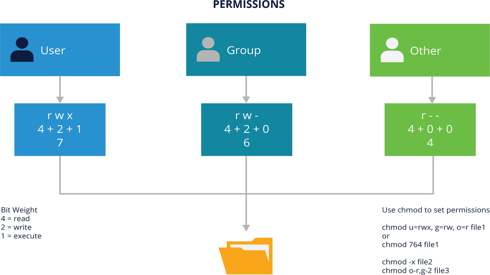

# 9. SECURITY FUNDAMENTALS
 
## Introduction
### Chapter Overview

Computer security is an ongoing process to keep the system secure and safe. There are several options to make the systems less easy to disrupt, beginning with good user and networking practices. This section will introduce user security for administrators and describe some other security options available in most Linux distributions.

### Learning Objectives

By the end of this chapter, you should be able to:

- Have a good grasp of best practices and tools for making Linux systems as secure as possible.

- Understand the powers and dangers of using the root (superuser) account.

- Use the sudo command to perform privileged operations while restricting enhanced powers as much as feasible.

- Explain the importance of process isolation and hardware access.

- Work with passwords, including how to set and change them.
Describe how to secure the boot process and hardware resources.

 
## Securing Linux

### User Accounts

The Linux Kernel allows properly authenticated users to access files and applications. While each user is identified by a unique integer (the user id or UID), a separate database associates a username with each UID. Upon account creation, new user information is added to the user database, and the user's home directory must be created and populated with some essential files. Command line programs such as [useradd](https://linux.die.net/man/8/useradd),[userdel](https://linux.die.net/man/8/userdel) and [usermod](https://man7.org/linux/man-pages/man8/usermod.8.html), as well as GUI tools are used for creating and removing accounts.

These commands are required for proper operation of the security on the system and need a restricted or super user that can perform duties like creating another user; that user would be the **root** user.

The root user is user id 0 and belongs to group 0. This is a special user in the system, as it can do almost anything on the system. The root user’s permissions are used to help initialize the system, start background jobs, start services and servers and a host of other functions. This makes logging on as the super user undesirable, since the slightest error typing in a command can leave the system dead.

<br><br>
### sudo and sudoers


There is a need for the administrator to occasionally require root-level permissions to perform actions like adding a new user to the system. A program called **sudo** can allow the command to execute the desired function. Users have to be added to the sudo configuration file in order to use its facilities. The configuration file is called `sudoers`, and this is the place to add extra administrators to perform functions that are not included in their normal permissions. Most Linux distributions automatically add a `sudoers` configuration for the admin user installing the system. The configuration may be in the main configuration file `/etc/sudoers`, or any file name in the `/etc/sudoers.d/` directory.

Here are a couple directives from a `sudoers` file:

```bash
sudo cat /etc/sudoers
```
```
...[output removed]
# This file MUST be edited with the 'visudo' command as root.
# Please consider adding local content in /etc/sudoers.d/ instead of # directly modifying this file.
...[output removed]
# User privilege specification
root ALL=(ALL:ALL) ALL
...[output removed]
#includedir /etc/sudoers.d
...[output removed]
```

It is common practice to use the **includedir** option in the `/etc/sudoers` file. Create a file for each user in the `/etc/sudoers.d` directory with appropriate directives. The directives are available in the `sudoers man` page. Here is an example of a `sudoers` file for the user **student**.

```bash
sudo cat /etc/sudoers.d/student
```

```
student  ALL=(ALL:ALL) ALL
```

<br><br>

### /etc/passwd

For each system user, there is a record with seven fields in it. There is one record for each user maintained in the `/etc/passwd` file.

The **passwd** entries look like:

```bash
head -n 3 /etc/passwd
```
```
root:x:0:0:root:/root:/bin/bash
daemon:x:1:1:daemon:/usr/sbin:/usr/sbin/nologin
bin:x:2:2:bin:/bin:/usr/sbin/nologin
......
student:x:1000:1000:LF Student :/home/student:/bin/bash
.....
```

The table below highlights the seven fields of the `/etc/passwd`:

|FIELD NAME	| DETAILS |	INFORMATION|
|---|---|---|
| **Username** | User login name | Generally, between 1 and 32 characters long, lowercase. For example, **student** |
| **Password** | User password | This is an **'x'** and the password is encrypted and stored in `/etc/shadow` |
|**User ID (UID)**|	Unique number associated with the user |- 0 is reserved for the root user <br> - Generally, 1-1000 are predefined or system service accounts <br>- 1000 and higher are for regular users |
|**Group ID (GID)**|	Unique group number assigned to the user. Primary group is in `/etc/passwd` |	Additional groups may be assigned to a user with the `/etc/groups` file entries. The primary group is the default assigned during the file or directory creation process.|
|**GECOS or comment**|	More commonly used for full name |	For example, **Student One**|
|**Home directory**| The absolute path of the user's home directory |	Usually `/home/student`|
|**Default shell**|	The absolute path of the user's default shell |	For example, `/bin/bash`|

The password is not stored in the `/etc/passwd` file, as every user on the system must be able to read the `/etc/passwd` file.
<br><br>

### /etc/shadow

Passwords are stored in the `/etc/shadow` file, as it is only read or written to by the root user.

The `/etc/shadow` entries look like:

```bash
sudo grep student /etc/shadow
```
```
student:$6$VW8fB.7RajeLUSqI$ru6srhOAQu2GxKI7aqqcQZK/K/V6stJbyO/c55MZUvJHC6Ehi9YYhrunrLfW./ZbMSkbPtCql4EvCxNyXrnFC1:18920:0:99999:7:::
student2:$6$Q6G.Qz.jqrQt80SN$Y67qXl.7Bcq63s.VxPtLfkpwjCcgMaSBBSGMCCK4PVQfSCHvarNtLrNbkpYY2uuFQSZCMT9y0smUFDWD4bMO2/:18949:0:99999:7:::
```

The `/etc/shadow` file contains the following components:

| FIELD NAME |	DETAILS | INFORMATION |
|---|---|---|
|**Username**|	Same as `/etc/passwd` | Must be a valid account name |
|**Encrypted Password**| Generated by the system | If empty, no password needed, but many applications will refuse to run|
|**Last Changed**|	The number of days (since January 1, 1970) since the password was last changed | If the value is '0', it will force the user to change their password on next login |
|**Minimum Password Age**|	Number of days before the password may be changed | If empty, no minimum age |
|**Maximum Password Age**|	Maximum number of days before the user must change their password | Must be older than the minimum password age |
|**Password Warning Period**|	Number of days before the password expires; warnings start | Warning period in days |
|**Password Inactivity Period**| Number of days after "maximum password age" when password is still accepted | After inactivity period + maximum password age, no login possible |
|**Account Expiration Date**| The expiration date of the account, in days, since January 1, 1970 | No grace period |
|**Reserved field**| For future use	| Can extend capabilities |

The aging values can be displayed or altered by the `chage` command:

```bash
chage -l student
```
```
Last password change                                 : Oct 30, 2021
Password expires                                     : never
Password inactive                                    : never
Account expires                                      : never
Minimum number of days between password change       : 0
Maximum number of days between password change       : 99999
Number of days of warning before password expires    : 7
```

The `chage` command and its various options allow you to set or modify expiration times:
```
Usage: chage [options] LOGIN 

Options: 
  -d, --lastday LAST_DAY        set date of last password change to LAST_DAY
  -E, --expiredate EXPIRE_DATE  set account expiration date to EXPIRE_DATE
  -i, --iso8601                 use YYYY-MM-DD when printing dates
  -I, --inactive INACTIVE       set password inactive after expiration to INACTIVE
  -l, --list                    show account aging information
  -m, --mindays MIN_DAYS        set minimum number of days before password change to MIN_DAYS
  -M, --maxdays MAX_DAYS        set maximum number of days before password change to MAX_DAYS
  -R, --root CHROOT_DIR         directory to chroot into
  -W, --warndays WARN_DAYS      set expiration warning days to WARN_DAYS
```

If the only parameter passed to the `chage` command is the **LOGIN** id, **chage** will step through the options. Root access (**sudo**) is required for most operations with this command.


<br><br>

### Linux File Permissions Security

The Linux filesystem has a permission entry in the index node or inode in the filesystem. This permissions entry can be viewed with the command:

```bash
ls -l
```
```
total 32
drwxr-xr-x 2 student student 4096 Nov 1 18:16 Desktop
drwxr-xr-x 2 student student 4096 Nov 1 18:16 Documents
drwxr-xr-x 2 student student 4096 Nov 1 18:16 Downloads
-rw-rw-r-- 1 student student    0 Nov 6 06:01 file1
-rw-rw-r-- 1 student student    0 Nov 6 06:01 file2
-rw-rw-r-- 1 student student    0 Nov 6 06:01 file3
-rw-rw-r-- 1 student student    0 Nov 6 06:01 file4
-rw-rw-r-- 1 student student    0 Nov 6 06:01 file5
drwxr-xr-x 2 student student 4096 Nov 1 18:16 Music
drwxr-xr-x 2 student student 4096 Nov 1 18:16 Pictures
drwxr-xr-x 2 student student 4096 Nov 1 18:16 Public
drwxr-xr-x 2 student student 4096 Nov 1 18:16 Templates
drwxr-xr-x 2 student student 4096 Nov 1 18:16 Videos
```

The output format of the `ls -l` command is (from left to right):

- **-rw-rw-r--** This is the mode or permissions field
- **1** This is the link count
- **student** User or Owner of the file
- **student** The group affiliation of the file
- **size** Size in bytes
- **month** Month
- **day** day of month
- **time** Time last modified
- **file** Name of the file

The following image shows the permissions for **file1**. Each of the ownership categories (**user, group, other**) have the associated letter assignment (**rwx**) and the bit weighted numerical value. All files have ownership categories that include user (or the owner of the file), group (or the group that owns the file), and then all others than the owner and group owner. Included is the command to set/change the permissions with the `chmod` command using either letters or numbers. The **file2** and **file3** examples are removing specific permissions using the chmod letter assignments.



**Permissions for _file1_**

Looking at the **Permissions** graphic above, here is the listing for **file1** showing the components of the `ls -l` command:

|MODE|LINK COUNT|USER|GROUP|SIZE|TIME STAMP|FILENAME|
|---|---|---|---|---|---|---|
|-rw-rw-r--|1|student|student|0|Nov 6 06:01|file1|

<br>

The string **-rw-rw-r--** is the permissions record, or mode:

|TYPE||USER|||GROUP|||OTHER||
|---|---|---|---|---|---|---|---|---|---|
||read|write|execute|read|write|execute|read|write|execute|
|-|r|w|-|r|w|-|r|-|-|

The first entry is the **type** field, the common options are:

- **-** regular file
- **d** directory entry
- **l**** soft link
- **c** character device
- **b** block device
- **p** named pipe
- **s** socket

The next block is a 3-digit (base 8) number. Each of the digits has a value that corresponds to the letter displayed:
- 1 = execute
- 2 = write
- 4 = read

These digits are added together to form a number. So, **rw-** would be 4+2+0=6

Some more examples:

- **rwx** would be 4+2+1=7
- **r-x** would be 4+0+1=5
- **-w-** would be 0+2+0=2

There is an octet for each of the following: **user** (sometimes called also as 'owner'), **group**, and **other** (sometimes called as 'world').

There are permissions for each user, group and other in that order:
- 644  user (rw-) group (r--) other (r--)
- 745  user (rwx) group (r--) other (r-x)

The order in which permissions work is on a first match basis. 

- If the owner tries to access the file or directory, then the owner mode bits apply. 

- If not the owner, but the user has the group affiliation either in `/etc/passwd` as the primary group or as a supplementary group in the `/etc/group` file, then the group permissions apply.

- If your user id does not match the owner of the file or have a group match either in your primary group or extra groups, then the other permissions apply.


<br><br>

### Additional File Security

Besides the standard filesystem security, there are additional options for securing files, directories or ports.

- **Access Control Lists (ACL)**

    An [ACL](https://en.wikipedia.org/wiki/Access-control_list) is a list of permissions associated with a system resource, and specifies which users or system processes are granted access to objects, and what operations are allowed on those objects. 

    - Displayed with the `getfacl` command, and modified with the `setfacl` command
    - Will allow for more than one user or group per file
    - Supported by most Linux filesystems.

- **SELinux**

    [SELinux](http://selinuxproject.org/page/Main_Page) is a finer-grained security option that provides a mechanism to support ACLs, including [Mandatory Access Controls](https://www.techtarget.com/searchsecurity/definition/mandatory-access-control-MAC), allowing system administrators to better control who can access the system. If something is not explicitly allowed, the action is denied. Can add a security record for:

    - Users
    - Groups
    - Network ports
    - Processes, etc.

- **AppArmor**

    [AppArmor](https://apparmor.net/) is a Linux kernel security module that allows system administrators to restrict a program's capabilities and use of resources.

    - Uses Linux capabilities
    - Configuration is usually done "by-example"

<br><br>

### User Passwords

While users can change their own password, root access (sudo) is required for most other password-related commands.

The contents of the password are enforced when the password is being changed. Most Linux distributions use the `pam_pwquality.so` security module to shape the password using a combination of upper and lowercase letters, numbers and special characters.

The time to crack a password can be estimated with the [password breaker](https://random-ize.com/how-long-to-hack-pass/).

<br><br>

### Least Privilege

The concept of [least privilege](https://us-cert.cisa.gov/bsi/articles/knowledge/principles/least-privilege) mandates having only the security permissions required to complete the job. If additional permissions are granted, then unauthorized access may be possible.

Linux has an ongoing project to enable only the privileges required through a mechanism called “capabilities". Rather than use the root user for anything a normal user cannot do, divide up some of the permissions into "capabilities" and assign only the permissions needed.

For additional details, consult the [capabilities man page](https://man7.org/linux/man-pages/man7/capabilities.7.html).

<br><br>

### Data Security


<br><br>

### Encrypted Filesystems
 

<br><br>

## Network Security


<br><br>

### SSL and Friends


<br><br>

### Firewalls


<br><br>

### Intrusion Detection Systems


<br><br>

### Other Intrusion Detection Systems